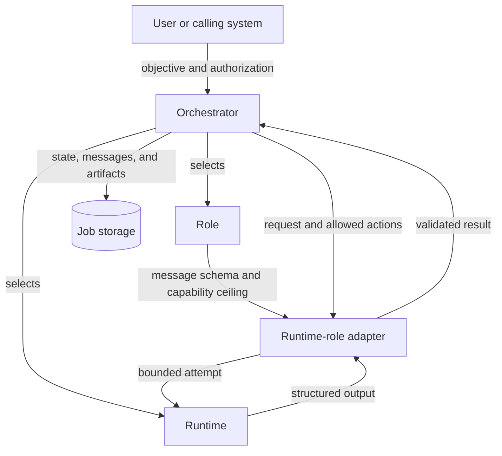
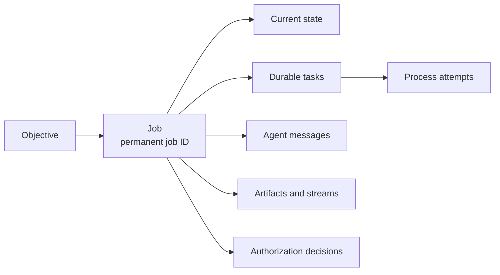

# Fundamental Concepts

Agent-orchestra separates seven concepts:

- a **job** is one tracked workflow instance for one objective;
- a **task** is one durable role assignment within a job;
- an **attempt** is one agent process execution for a task;
- a **role** defines what an agent task is responsible for;
- a **runtime** is the product that executes the attempt;
- an **adapter** translates between a runtime and the canonical workflow
  contract for a role;
- a **capability** is one narrowly scoped action the attempt may perform.

This separation lets different agent products use the same workflow. It also
lets new roles reuse the orchestration core.

The role defines the job and its maximum permissions. The runtime executes it.
The adapter translates between the shared message contract and that runtime.
The orchestrator accepts only a validated result and stores the workflow state.

## Jobs, tasks, and attempts

A job is one stored instance of a workflow for one objective. It links the
workflow state, agent messages, review iterations, artifacts, and authorization
decisions. Starting another task attempt or revising the local diff advances
the existing job; it does not create a new one.

Each job has a permanent **job ID**. Repo paths, worktrees, branches, URLs, Git
SHAs, and diff digests describe the job's current scope, but they are not its
identity. They may change while the job ID stays the same. Each task has a
stable task ID across retries, while each process launch has a distinct attempt
ID and positive attempt ordinal.

## Roles

A role defines one agent's job, request, result, and maximum permissions. It
does not depend on an agent product.

The workflows distinguish four responsibilities:

| Role | Responsibility | Worktree access |
|---|---|---|
| [Source-code developer](role-developer.md) (`developer`) | Implement an objective or remediate source-code review findings | Read and write the assigned worktree |
| [Source-code reviewer](role-reviewer.md) (`reviewer`) | Evaluate one immutable diff and return a verdict and structured findings | Read-only |
| [Issue creator](role-issue-creator.md) | Write or revise issue prose in response to readiness feedback | Provider write only when separately authorized |
| [Issue reviewer](role-issue-reviewer.md) (`issue_reviewer`) | Evaluate one immutable issue snapshot for implementation readiness | Read-only, without provider access |

The source-code developer, source-code reviewer, and issue reviewer are
currently dispatched agent roles. The issue creator is the corresponding
workflow responsibility, currently performed by a person or external system;
Agent Orchestra publishes feedback but does not yet dispatch an issue creator
to revise provider content.

The same role contract applies no matter which runtime executes it. A Codex
source-code reviewer and a Claude Code source-code reviewer receive equivalent canonical requests,
operate under the same permissions, and return equivalent canonical results.
The same rule applies to issue review: provider payloads are normalized before
either runtime receives them.

A supported role defines:

- a stable name;
- a canonical skill name;
- versioned request and result payload schemas;
- a least-privilege capability ceiling;
- a worktree access policy;
- artifact requirements and containment rules;
- specific lifecycle steps that may dispatch it and accept its outcomes.

The orchestrator may dispatch a developer and accept its handoff only in
`developing`. It may dispatch a reviewer and accept its result only in
`reviewing`. The orchestrator rejects unknown roles and roles used outside
their registered lifecycle states. A role name does not grant permission.

## System participants

Some workflow participants are not agent roles:

- The **orchestrator** validates messages, controls durable state transitions,
  binds approval to an immutable diff, selects adapters, and records evidence.
- The **authorization authority** is the user or system that allows or denies a
  specific commit or remote action.
- An **issue source adapter** reads GitHub through `gh` or GitLab through
  `glab`, then returns a provider-neutral snapshot. A **Git provider adapter**
  changes GitHub or GitLab only for the
  provider operation it was asked and authorized to perform.

These participants are not developers or reviewers. A state change does not
prove that the user authorized a commit or remote action.

## Runtimes

A runtime is the product that runs an agent. Codex and Claude Code are the first
supported runtimes.

Runtime selection answers **how** a role is executed, not **what** the role may
do. Runtime-specific details include:

- executable and command-line flags;
- authentication and configuration locations;
- model selection;
- non-interactive input and structured-output mechanisms;
- sandbox or filesystem controls;
- process timeout and termination behavior;
- stdout and stderr capture.

Those details belong in runtime adapters and execution evidence. They do not
belong in canonical role payloads or lifecycle states.

Developer and reviewer runtimes are selected independently. The target adapter
matrix supports all combinations:

| Developer runtime | Reviewer runtime |
|---|---|
| Codex | Codex |
| Codex | Claude Code |
| Claude Code | Codex |
| Claude Code | Claude Code |

Mixed-runtime workflows use the same canonical messages and state transitions
as single-runtime workflows.

## Adapters

An adapter connects the shared workflow to a specific runtime. The orchestrator
selects one by `(runtime, role)`.

An adapter must:

1. Accept the canonical request for its assigned role.
2. Verify that the runtime executable and canonical role skill are available.
3. Translate the request into a bounded, non-interactive runtime attempt.
4. Enforce the role's worktree access policy and capability ceiling.
5. Translate structured runtime output into the canonical role result.
6. Apply local schema and correlation validation even when the runtime claims
   to enforce an output schema.
7. Return stable diagnostics for missing dependencies, timeouts, process
   failures, malformed output, and unsupported options.
8. Keep temporary files, messages, artifacts, and logs outside the target
   worktree unless the role explicitly creates a repo artifact.

The orchestrator accepts only a validated standard result. It does not parse
conversation text or use runtime-specific verdict logic.

An adapter is not an authorization mechanism. Selecting a runtime or model does
not broaden the request's allowed actions.

## Capabilities

A capability names one action. A role defines the maximum set; each request
allows a subset. An agent receives only actions present in both sets.

Representative capabilities include:

- read the assigned worktree;
- edit the assigned worktree;
- run local validation;
- write a declared job artifact;
- perform a named remote read;
- perform one separately authorized commit or remote write.

Capabilities are preferable to assumptions such as “developers may use Git” or
“reviewers are trusted.” A developer may edit files during remediation without
being allowed to commit. A reviewer may run read-only tests without being
allowed to fix a finding. Remote writes require a separate authorization even
when the acting role has the technical means to perform them.

The orchestrator rejects:

- capabilities unknown to the current protocol version;
- capabilities outside the registered role's ceiling;
- results claiming actions absent from the request;
- runtime options that would grant broader access than the effective
  capabilities.

## Canonical messages and artifacts

Versioned UTF-8 JSON messages are the machine contract between the orchestrator
and each adapter. The envelope identifies the job, message, correlation,
iteration, sender, recipient, and exact diff. The payload carries the assignment
or result.

Markdown is a human-readable artifact. Agent stdout and stderr are execution
logs. Neither is parsed to reconstruct workflow state.

Each external process has adapter-neutral attempt evidence. It identifies
the role, agent vendor, optional requested model override, effective models
reported through stable runtime metadata, runtime, iteration, attempt,
timestamps, exit status, timeout or interruption status, and the separate
stdout and stderr paths. Effective identity is explicitly unavailable when the
runtime does not report it; defaults and human-formatted log headers are never
treated as evidence. Multiple identities preserve fallback or helper-model use.
Agent identity answers which agent was selected; runtime identity names the
executable adapter used to invoke it. This evidence can explain execution
without promoting process output into canonical workflow state.

Adding a runtime does not add new canonical message types when it implements an
existing role. Adding a role normally adds role-specific request and result
payload schemas, but it must not change unrelated roles' payloads.

## Adding a role

Add a production role only when a concrete workflow requires a distinct
responsibility, capability boundary, result contract, or lifecycle outcome that
cannot be represented safely by an existing role.

For example, a future `tester` could receive a validation assignment, run
commands without editing tracked files, and return structured test evidence.
It would differ from a reviewer if its contract reports verification results
without producing an approval verdict or general code findings.

A new role requires:

1. A documented responsibility and reason an existing role is insufficient.
2. A least-privilege capability ceiling and worktree policy.
3. Versioned canonical request and result schemas.
4. A canonical, vendor-neutral skill with lifecycle metadata.
5. An explicit registration mapping message types, schemas, capabilities, and
   allowed lifecycle steps.
6. An adapter for every runtime claimed to support that role.
7. Contract tests shared by those adapters.
8. Permission, path-containment, message-correlation, failure, and lifecycle
   tests.
9. Source and wheel packaging verification for skills and entry points.

The role registry is for dispatch and validation, not automatic trust. A role
or runtime-role combination remains unsupported until it is implemented and
tested.

## Current implementation boundary

See [Current scope](../README.md#current-scope) for the implemented roles,
adapters, commands, and remaining target work.
