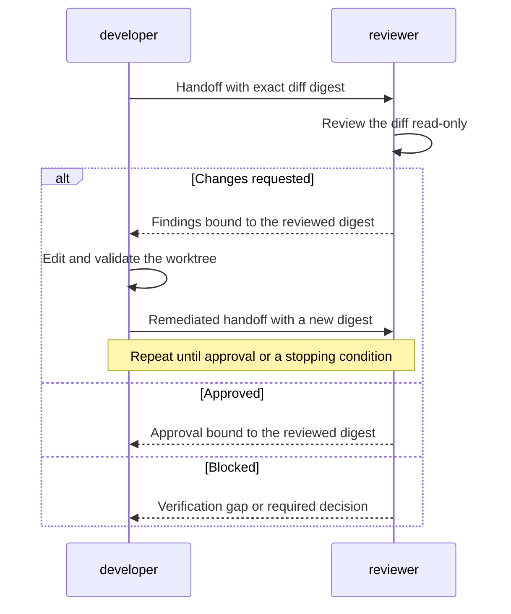

# Design

## How it works

A user invokes the CLI to have one source-code change developed and independently reviewed.
Agent-orchestra records that work as a
[job](concepts.md#jobs-tasks-and-attempts), so it can preserve the objective,
progress, and review history across task attempts.
The [orchestrator](concepts.md#system-participants) then coordinates the two
source-code roles:

1. The [source-code developer](concepts.md#roles), represented by the
   `developer` protocol role, edits and validates the assigned
   worktree, then returns a handoff.
2. The orchestrator records the exact diff digest and asks the
   [source-code reviewer](concepts.md#roles), represented by the `reviewer`
   protocol role, to evaluate that diff. The source-code reviewer works
   read-only and returns an `approved`, `changes_requested`, or `blocked`
   verdict.
3. After `changes_requested`, the orchestrator gives the complete findings to
   the source-code developer. That role addresses them, and the source-code reviewer evaluates the
   new diff. This cycle continues until approval or a stopping condition.

The sequence diagram focuses on the two agent roles. The orchestrator mediates,
validates, and durably persists every exchange shown between them.



The source-code developer and source-code reviewer communicate through versioned
[messages](concepts.md#canonical-messages-and-artifacts). A
[runtime](concepts.md#runtimes) and [adapter](concepts.md#adapters) execute each
role with only its allowed [capabilities](concepts.md#capabilities). SQLite
stores the job state, while messages, artifacts, and streams remain outside the
target worktree.

Approval applies only to the reviewed diff. Commit and publication require
separate decisions from the
[authorization authority](concepts.md#system-participants).

The current CLI implements this bounded loop for existing local changes through
the Codex and Claude Code adapters. Custom reviewer commands retain the
single-review compatibility path. See [Current scope](../README.md#current-scope)
and the [workflow contracts](workflows.md) for that boundary.

## Why SQLite

Agent-orchestra runs as an on-demand local CLI, so a separate database service
would add setup and maintenance without improving the current workflow. SQLite
provides transactions and constraints in an embedded database file. WAL mode
allows readers while a writer commits, and state-checked updates reject stale
writes after another process advances a run. This is enough for run metadata
and transition history.

Keep the database outside target worktrees so state changes do not affect the
diff under review. SQLite fits one-machine coordination; a distributed or
multi-host service would need a different storage implementation behind the
same interface.

## State transition history

One ordered transition table records state changes for both source-code and
issue-review [jobs](concepts.md#jobs-tasks-and-attempts). Each row carries the
opaque job ID, scenario, prior and next
state, occurrence time, and the diff or source digest current at that
transition. Job creation records an initial transition with no prior state;
every later row is inserted in the same transaction as its successful
state-checked job update.

Schema initialization migrates run-only transition rows into this shared
shape. Their transition-time digest is unknowable and remains null; current
rows must never be backfilled from a job's later digest. New transitions record
the current scope digest when one is available and otherwise keep it null. The
store exposes transition history in persistent row order through a read-only
API that neither initializes nor changes the database.

## Evidence paths and integrity

All paths beneath the configured runs directory hold a job's
[canonical messages and artifacts](concepts.md#canonical-messages-and-artifacts),
and are resolved through one job-scoped resolver. It rejects absolute or multi-component path segments,
traversal, mismatched job identifiers, and symlinks in any existing component.
The separate workflow check that keeps the runs directory outside the reviewed
worktree remains authoritative at that boundary.

Timestamp-shaped job identifiers place evidence beneath a UTC date shard
derived only from the identifier: `YYYYMMDDTHHMMSSZ-*` resolves to
`RUNS_DIRECTORY/YYYY/MM/DD/JOB_ID/`. The resolver performs no clock, timezone,
locale, or database lookup. Identifiers without the timestamp shape resolve
directly beneath the runs directory. The configured runs directory remains the
evidence root; shards are an internal layout detail. Evidence previously written
flat under a timestamp-shaped identifier may become unreachable, and commands
report missing evidence through their normal error contract.

Each job maintains a versioned `.integrity.json` index under its job directory.
Once an atomic evidence write is renamed into place, the writer hashes the
regular file without following a final symlink and atomically replaces the
index while holding the job's integrity lock. Entries are keyed by job-relative
path and contain the job ID, evidence type, byte size, SHA-256 digest, and UTC
finalization time. Rewriting a mutable evidence location replaces its prior
entry; the index and its lock are internal metadata and do not index themselves.
Evidence types are the explicit semantic vocabulary `execution`,
`review_request`, `review_result`, `remediation_request`, `developer_handoff`,
`review_artifact`, `rejected_review_result`, `rejected_review_artifact`,
`rejected_developer_handoff`, `decision_required`, `failure`,
`invocation_record`, `process_stdout`, `process_stderr`, `issue_snapshot`,
`issue_review_request`, `issue_review_result`, and `issue_feedback`. Writers
must select one of these values; directory names, filename stems, and iteration
ordinals are not evidence types.
Before the evidence rename, the same locked protocol durably writes a pending
transaction. A later writer or resumed job reconciles that transaction, so an
exit between the evidence and index renames cannot permanently strand finalized
evidence without an entry. Existing indexes are validated strictly for schema,
job identity, required fields, unique contained paths, and scalar field types
before they may be updated.
The index-level `backfilled_at` field is null when the index originates with the
job's first native finalized write. It records the UTC discovery time when an
index is first created around existing evidence. Audit treats that marker as a
partial pre-index provenance signal rather than interpreting omitted files as
post-finalization deletion.

Process streams remain live while their child runs. Their entries are recorded
only when the corresponding invocation reaches `completed`. Integrity paths
are job-relative so a future date shard above the job directory does not alter
their identity.

## Synchronization and collision avoidance

Agents do not maintain inboxes or wait on a shared message queue. The current
orchestrator is an on-demand, synchronous CLI process. Before starting an
adapter, it atomically writes that role's complete request under the run
directory and passes the request and response paths to a newly invoked agent
process. The agent therefore starts with a message already available; it does
not poll for one. The orchestrator waits for that subprocess to exit, subject
to the role-specific positive timeout, and then validates the response file.
Stdout and stderr are logs only and are not synchronization channels.

Each accepted response determines the next dispatch. For example, a valid
`changes_requested` review is persisted before the developer process starts,
and a valid developer handoff plus a new diff digest is persisted before the
next reviewer starts. Atomic file replacement prevents consumers from seeing a
partially written request or response. Monotonic per-run sequence numbers,
unique message IDs, `in_reply_to`, iteration, and exact scope correlation make
stale or duplicate messages invalid.

If a future resident worker or independently running agent needs asynchronous
delivery, it may poll durable run state and message sequence numbers or use a
wakeup notification as an optimization. SQLite state and canonical message
files must remain authoritative: a notification alone must never advance the
workflow, and a missed notification must be recoverable by rereading durable
state.

SQLite prevents competing orchestrators from silently advancing the same run.
Every store mutation runs in a transaction. A state update uses compare-and-set
semantics: its `UPDATE` matches both the run ID and the expected current state.
The state change and its transition-history row commit together. If another
worker wins the race, the losing update affects no row and raises a concurrent
update error instead of overwriting the newer state. Primary keys prevent run
ID collisions, foreign keys protect transition ownership, and a five-second
busy timeout bounds lock contention.

WAL mode lets readers inspect status while a writer commits and allows only one
writer to commit at a time. These database guarantees protect durable run
metadata; they do not replace diff-digest checks or message validation. The
worker still freezes and verifies the exact worktree digest around every
read-only review, because SQLite cannot lock arbitrary worktree files changed
by another process.

## Principles

- Use an on-demand CLI and SQLite instead of a resident service.
- Keep agent, Git provider, and worktree operations behind typed interfaces.
- Review an immutable diff digest; any code change invalidates approval.
- Store structured findings and render Markdown as a human-readable artifact.
- Treat committing and publishing as separate, explicit authorization gates.
- Preserve worktrees and changes that the orchestrator does not own.
- Make every workflow transition durable and resumable.
- Separate agent roles from the runtimes that execute them.
- Grant capabilities by registered role and fail closed for unknown roles.
- Give a value that several functions need an owner rather than a parameter.

These choices optimize for local agents and minimum resource use. Python is the
preferred implementation language, with a toolchain based on uv, Ruff, and
mise.

The public contract is the CLI: its commands, their arguments, and the versioned
JSON documents they emit. The package root defines and re-exports no application
names. `agent_orchestra` is a namespace for its submodules, which remain
importable as `from agent_orchestra import cli`; what it does not offer is a
second path to the objects those submodules define. Every caller imports a name
from the module that defines it. Re-exporting at the root would create a
duplicate import path for each name, couple import order to the root module, and
go stale as modules move.

The root did once re-export `Run`, `RunState`, and `ScenarioType`, from the
package's first commit until they were removed. Removing them is an intentional
breaking change to an importable surface, accepted rather than deprecated: the
package is pre-1.0, is not published to any index, and no consumer of those
imports could be identified inside or outside the repository. A deprecation shim
would have preserved a path nothing used. Were any of those conditions to change, a
removal of this kind would warrant a transition period instead.

## Collaborators and value types

Two kinds of object carry state, and the difference decides where new code goes.

**Value types own data and pure derivations.** `Run`, `IssueJob`,
`InvocationRecord`, `JobTransition`, `IntegrityEntry`, `Manifest`, and
`RuntimeDefinition` are frozen dataclasses. Their instance methods compute only
from their own fields, as `RuntimeDefinition.supports` does. They depend on no
subsystem that reads or writes: no store, evidence root, registry, or provider.

Their classmethod constructors may consult ambient state to capture a value at
creation. `Run.create_local` resolves the repository and worktree paths, reads
the clock, and draws entropy for the job identifier. That is capture, not
persistence: the constructor records what was true when the value was made and
then the value is inert. The line that matters is not whether a byte was read,
but whether the type reaches into a subsystem that another object owns.

**Collaborators own identity, and take one of two shapes.**

*Service collaborators* hold configuration fixed at construction and expose the
operations that use it. `JobStore` owns a database path, `RuntimeRegistry` owns
the set of runtimes, `JobEvidence` owns one job's evidence root and identifier,
and `InvocationEvidenceStore` owns one job directory. Callers ask them to do
things rather than reading their fields.

*Parameter groups* name a set of values that belong together and are consumed by
functions rather than by methods. All are frozen dataclasses in
`execution_context.py`, and the worker functions unpack them:

| Group | Holds | Scope |
|---|---|---|
| `WorkerContext` | The four collaborators a worker invocation needs. | Caller-supplied; invariant for the whole invocation. |
| `ReviewPlan` | One single-reviewer workflow's objective, commands, limits, and identities. | Fixed for the workflow; taken from the caller or rebuilt from evidence. |
| `ReviewerSetReviewPlan` | The same for a reviewer batch, with a reviewer execution plan in place of one command. | As above. |
| `ResumedExecution` | A stopped run's execution record and the identities resolved for it. | Recovered from evidence at the start of one resume. |
| `ReviewerRound` | One batch iteration's run states, reviewed digest, and sequence position. | Rebuilt for each iteration. |

A parameter group may carry a constructor that builds it from somewhere else, as
`ReviewPlan.from_execution_record` builds one from durable evidence.

A parameter group does not hold a `Run`. `workflow.transition` returns a
replacement carrying a new state and iteration, so a group that stored one would
go stale at every transition; only the run's identity is durable, and it is
passed alongside. `ReviewerRound` is the single scoped exception: it holds the
two run snapshots one iteration's steps were already being passed individually,
and it is rebuilt for the next iteration rather than updated, so it cannot
outlive the transitions that would make it stale.

The distinction is worth keeping: a service collaborator earns its methods,
while a parameter group exists to stop a set of values being threaded by hand.
Adding a method to a parameter group is a sign it is becoming a service, or that
the method has no caller.

The rule that separates them: when a group of values always travels together,
is always derived from the same source, and is passed by hand through a call
chain, that group is a collaborator waiting to be named. Adding a cross-cutting
value should be a new field, not an edit to every signature in the chain.

Two consequences worth stating, because both were learned by getting them
wrong:

- **A collaborator is not a place to put anything shared.** Split by
  provenance. `WorkerContext` holds what the caller supplies identically on
  every path; `ReviewPlan` holds what the run path takes from the caller and the
  resume path rebuilds from durable evidence. Merging them would silently use
  caller values when resuming.
- **Verify that repeated code actually agrees before unifying it.** Three
  consolidations in this codebase each hid a real difference: lock preambles
  that differed in which exception they translated, evidence-root derivations
  that diverge through a symlinked root, and a timeout that was optional in one
  function and required in another. Read every copy before replacing them with
  one.

Refactors that introduce a collaborator change no public document, evidence
path, or stable error code, and do not move `CLI_SCHEMA_VERSION`.

### Package exception hierarchy

Every exception declared by `agent_orchestra` derives from
`AgentOrchestraError`, giving callers one package-wide root when a boundary
deliberately handles every domain failure. Package exceptions do not also
derive from `ValueError`, `RuntimeError`, or `OSError`: catching one of those
builtins should not accidentally absorb a domain failure just because of its
implementation history.

`RunNotFoundError` additionally derives from `LookupError`. A missing run is a
failed keyed lookup, so retaining that builtin semantic base is deliberate and
covered by the package hierarchy tests. It is the sole exception to the rule
against builtin bases.

Most boundaries should catch the narrowest errors they can translate
correctly, rather than `AgentOrchestraError`. A package-root catch is suitable
only when every package failure in the protected operation has the same public
meaning. This keeps an unrelated manifest, evidence, or runtime failure from
being persisted or reported under the wrong subsystem's error code.

### Typing a persisted enum value

A value written to durable evidence and read back is typed as its enum, and the
enum is the only place its legal values are written down. `AttemptStatus`,
`AttemptConclusion`, `RuntimeRole`, and `EffectiveModelStatus` derive from
`PersistedEnum`, which supplies `values()` for validation and `decode()` for
widening. `InvocationRecord` carries those enums directly; there is no parallel
`Literal` alias and no hand-written value set anywhere.

The reason a persisted value cannot simply be widened is that the standard
library expression `EnumT(value)` raises `ValueError` for anything this build
does not recognize. That builtin implementation error must not escape the read
boundary or become a semantic base for the package's own errors. `decode()`
instead widens through a caller-supplied failure function, so each subsystem
keeps its own stable domain error: `InvocationEvidenceError` for invocation
records, `PersistedEnumError` from the `store` decode boundary for job state.

Enum typing therefore depends on the read path passing through such a boundary.
Invocation evidence has exactly one, where a record is constructed from its
document, and every enum field is decoded there. `Run.state` and `Run.scenario`
are enum-typed for the same reason. `JobTransition` keeps `RunState | str`
deliberately, so `audit` can report an undecodable transition as a finding
rather than failing the whole document.

A generated `Literal` is not an option, and the attempt is recorded so it is not
retried: `Literal[*(member.value for member in Enum)]` is correct at runtime but
a type checker rejects it with "Variable is not valid as a type", because
`Literal` requires its members spelled out statically. Choosing between a
hand-written `Literal` that can drift and the enum itself, the enum wins.

Adding a member is one edit. Because no second spelling exists, there is nothing
to keep in step; the tests verify that `values()` matches the members and that
each field fails closed when persisted evidence carries a value this build does
not know.

## Job ID format

The [job ID](concepts.md#jobs-tasks-and-attempts) has the form
`{UTC timestamp}-{random hex}`, such
as `20260902T130000Z-a7f3c921`. The timestamp makes IDs sortable, and the random
suffix avoids collisions. Consumers treat IDs as opaque strings so older
UUID-based runs remain readable.

## Packaged knowledge manifests

Volatile provider, [runtime](concepts.md#runtimes)-[adapter](concepts.md#adapters),
and canonical evidence naming knowledge is stored as TOML under
`agent_orchestra/manifest`. Every manifest has this
required header:

| Field | Type | Meaning |
|---|---|---|
| `id` | String | Stable identifier matching the packaged filename. |
| `kind` | String | `provider`, `runtime`, `evidence`, or `assignment`. |
| `schema_version` | Integer | Version of the manifest document schema. |
| `min_engine_version` | Integer | Lowest manifest engine able to interpret it. |

Provider manifests contain ordered `failure_rules`; the first matching regular
expression determines the public error code. Runtime manifests contain the
ordered argument arrays for `reviewer`, `issue_reviewer`, and `developer`
profiles. The evidence manifest pairs each writer template with its audit
recognition pattern, so producers and consumers share one naming contract.
The assignment manifest holds one instruction template per agent role, keyed by
`RuntimeRole`, whose only placeholder is `{request}`.
Filesystem ordering never affects resolution.

### Where each role's assignment comes from

An agent role is told what to do in one of two ways, and the choice follows the
capabilities the role is granted.

| Role | Assignment | Why |
|---|---|---|
| `developer` | `agent-orchestra-developer` skill | Has the `Skill` tool and reads its instructions from disk. |
| `reviewer` | `agent-orchestra-reviewer` skill | Same. |
| `issue_reviewer` | `assignment` manifest, inlined into the request | Granted no tools, so it cannot read a skill and must be handed its instructions. |

A skill is the right home when the role can load one. When the role is
deliberately tool-less, the assignment still belongs in versioned packaged data
rather than in a Python string, so it can be reviewed and changed without a code
change. `issue_review_prompt` renders the packaged template around the request
document and inlines the result, which is what a tool-less role requires.

Adding a role means deciding which of the two applies. Granting a role the
`Skill` tool solely so it can read a skill widens its capability ceiling, and
both supported runtimes must be able to load the same skill for that to be
acceptable.

The runtime registry in `adapter/registry.py` owns runtime identity, vendor,
role capability, adapter implementation, and manifest-placeholder requirements.
Parser choices, dispatch, skill targets, and runtime-metadata handling derive
from this ordered registry. Manifest data controls invocation arguments; the
registry controls which implementation consumes that data for each role.

Manifest schema version `1` is the only accepted document shape;
`manifest_schema_version_unsupported` rejects any other version.
`MANIFEST_ENGINE_VERSION` is the interpreter contract. Startup validates every
packaged manifest. Invalid TOML, missing or mistyped fields, invalid patterns,
and incomplete profiles fail with `manifest_malformed`. A manifest whose
`min_engine_version` exceeds the running engine fails with
`manifest_engine_too_old`. Neither error permits partial application. Manifests
ship with the Python package and are never fetched remotely.

### Why manifests are packaged rather than configurable

Packaged manifests are part of the installation, not configuration. There is
deliberately no override mechanism: no settings key, no environment variable, no
`--manifests-dir` flag, and no XDG search path. A manifest that fails validation
means the installation is invalid or incompatible, so the remedy is to reinstall
or upgrade rather than to edit installed package data.

The six manifests are not one category. What an override would do differs by
kind, and a proposal that treats them alike is reasoning about the wrong risk:

| Kind | Manifests | What an override would change |
|---|---|---|
| Runtime profile | `codex`, `claude-code` | The agent capability ceiling. |
| Evidence | `evidence` | A contract with evidence already on disk. |
| Assignment | `assignments` | The instruction text an agent is given. |
| Provider | `github`, `gitlab` | Only the error code a diagnostic maps to. |

Runtime profiles are the strongest case. They carry the exact arguments that
bound every agent this tool launches: the Codex reviewer profile sets
`sandbox_workspace_write.network_access=false` and excludes `/tmp` and
`TMPDIR`, and the Claude Code reviewer profile sets `--strict-mcp-config` with
an empty `mcpServers` object and a fixed `--tools` list. Loading those from a
writable path would let a TOML edit grant an agent network access, filesystem
write, or arbitrary MCP servers. The profiles also pass `--ignore-user-config`
and `--setting-sources ""` precisely so ambient user configuration cannot reach
the agent; making the profiles themselves user-configurable would reintroduce
the exposure those flags exist to remove.

The evidence manifest is a contract with data that already exists. Its
templates and audit recognition patterns are two halves of one naming
agreement, and overriding either half makes previously written evidence
unrecognizable to the classification step: `canonical_evidence_type` returns
`None` for a path the old manifest produced. Audit does not ignore that
quietly. An indexed path that still falls inside a manifest-owned namespace is
reported as `unknown_canonical_evidence`, a path whose manifest type disagrees
with its indexed type is reported as `evidence_type_mismatch`, and integrity
verification of indexed evidence runs independently of manifest recognition.

The hazard is subtler than a missing finding. Both the recognition patterns and
the set of manifest-owned namespaces derive from the same manifest, so an
override moves the frame of reference along with the layout. An override that
relocates templates to a new top-level namespace leaves evidence written under
the old one outside every namespace audit knows to police, and `audit --verify`
then reports against a layout that does not match what was written.

The assignment manifest holds the text a tool-less role is handed in place of a
skill. A writable assignment is prompt injection into a role that was granted no
tools on purpose.

Provider manifests are the only ones whose override would be safe in principle.
They classify provider stderr into public error codes and grant nothing, so a
future proposal to make any manifest configurable should start from that scope
rather than from all six. Proposing such a change is separate work and should
cite this section.

Manifests live in `src/agent_orchestra/manifest/` and load through
`importlib.resources` rather than shipping as top-level `data-files`. Package
data cannot be separated from the code it must stay in sync with, and it
resolves identically from a wheel, a zip, and an editable install, so the engine
never has to search the filesystem for the data that bounds it.

The data directory is deliberately not named `manifests`, because the module
`agent_orchestra/manifests.py` already owns that name. A same-named directory
resolves as a namespace-package portion and loses to the regular module only
while it has no `__init__.py`; adding one would silently make the directory the
import target and break every importer of the module. Distinct names remove
that dependence on import precedence, and the loader joins
`MANIFEST_DIRECTORY` from the parent package rather than naming the
directory at each call site.

## Job and task output

CLI output uses the public [`job` -> `task` -> `attempt`
hierarchy](concepts.md#jobs-tasks-and-attempts), introduced in schema version
10. The `jobs`, `job`, `tasks`, and `task` commands are separate
read-only views. `job.current` is always an array and contains only pending or
running tasks. Completed work remains in `tasks` history. Attempt output uses
`attempt_id` and embeds separately captured stdout and stderr streams.

The SQLite tables and canonical evidence retain their implementation-level
column and field names. Those names are not exposed by the CLI. This
keeps storage mechanics separate from the public vocabulary without adding
compatibility aliases to the command surface.

That retention is deliberate. `Run`, `Run.id`, and the `runs` table each
describe one source-code run and keep those names. Internal names are corrected
only when they claim a narrower scope than the thing they name: `create_job_id`
produces identifiers for both `Run.create_local` and `IssueJob.create`, and
`JobStore` owns the `runs`, `transitions`, `issue_jobs`, and `issue_actions`
tables. Both were previously named after runs alone, which made an issue job
look like a run or like a mistake.

Two names are knowingly kept despite covering both kinds. `RunState` types and
compares `IssueJob.state` as well as `Run.state`; it is retained because the two
states are one shared vocabulary rather than two parallel ones, and no name
covering both reads better than the one it has. The package root once exported
it alongside `Run` and `ScenarioType`, which made renaming it a public change;
those re-exports have since been removed, so a rename is now an internal
decision, and still not this one.
`InvocationRecord.run_id` carries an issue job's identifier for an issue review;
it is retained as stored evidence under the paragraph above, and the audit
document withholds it from published attempt objects, as it has since audit
schema 15. Renaming storage to match the
public vocabulary is likewise a separate decision, and is not this one.

### What a schema version promises

`schema_version` is an opaque integer, not a count of changes. Three rules
govern the **public documents** this project publishes to a separate reader.
Two version sequences carry them: `CLI_SCHEMA_VERSION` for the ordinary CLI
envelope, and the independent `AUDIT_SCHEMA_VERSION` for the audit document.
The rules are the same for both; only the sequence differs.

The split is by document, not by command. `audit` emits from both: a successful
audit is the audit document and reports `AUDIT_SCHEMA_VERSION`, while its
expected failures are ordinary CLI envelopes and report `CLI_SCHEMA_VERSION`.
A consumer should therefore read the version each document declares rather than
infer one from the command it ran.

1. **It advances only on a break.** Removing a field, renaming one, repurposing
   one, or changing what an existing value means advances the version. Adding a
   field, or adding a value to an enum, does not.
2. **A consumer must ignore what it does not recognize** — both a field it has
   no name for and a value it has no case for. That is what makes rule 1 safe:
   a document may gain either at any time, so a parser that rejects an unknown
   key, or that treats an unmatched enum value as invalid input rather than as
   one it does not handle, is asserting a contract this project does not offer.
   A consumer that must act on a value it does not recognize should say so and
   stop, not reject the document as malformed.
3. **`agent_orchestra_version` identifies the producing build.** It is the
   feature-detection channel, because a field added under rule 1 arrives without
   any change to `schema_version`. Every public CLI document carries it beside
   its schema version.

Every other versioned shape in the project follows the opposite rule, and
deliberately. That is not a short list, so the test is the reader rather than the
name: if a document is validated against an exact field set, it follows this
rule. `MANIFEST_SCHEMA_VERSION`, the invocation record, and the integrity index
check that by hand; every persisted record derived from `StrictSchema`, which
sets `extra='forbid'`, gets it from Pydantic — execution records and
reviewer-batch results among them. Each version names one exact shape, and
rejecting a document carrying an unexpected key is how a corrupted or
hand-edited file is caught rather than silently half-read. An added field is
therefore a shape change there, and advances that namespace's version like any
other.

Strictness per version is not the same as reading only what this build wrote.
Persisted evidence outlives the build that produced it, and a reader may accept
more than one version: `InvocationEvidenceStore` accepts invocation records at
schema 4 and 5, adapting a schema-4 record as it reads. Compatibility there is
expressed by naming each version a reader accepts, not by tolerating unknown
keys within one. Those documents carry no `agent_orchestra_version` because the
version already identifies the shape, and the reader adapts per version rather
than feature-detecting.

Applying the public-document rules to those shapes would be a real loss: strictness is
the property that makes persisted evidence trustworthy.

The version is never renumbered downward. The sequence below simply stops
advancing for additive changes, exactly as `apiVersion: v1` stays `v1` while the
resource it names gains fields.

Adding `agent_orchestra_version` was itself an additive change, and so did not
advance `schema_version`, which stood at 22 when it landed.

Every ordinary CLI envelope reports `CLI_SCHEMA_VERSION` and every audit
document reports `AUDIT_SCHEMA_VERSION`; neither carries a literal of its own.
The prune document did, and sat nine versions behind the rest of the CLI until a
test asserted the property across commands.

Schema version history. Every version through 22 was assigned under the earlier
policy of advancing for any change to a public document, so the entries below
are not examples of the rule above; most would not have advanced the version
under it. They are classified retroactively so the distinction the rule turns on
is legible in the sequence that exists. The rule governs changes from 22 onward.

Version 7 is the earliest recorded contract and is classified as neither, having
nothing before it to change. Every entry after it is marked **breaking** where it
removed, renamed, repurposed, or withdrew something a consumer read, and
**additive** where it only added:

- Version 7 exposed the former `status` and `logs` documents with `run_id`,
  `runs`, and `invocation_id` fields.
- Version 8 replaces those commands with `jobs`, `job`, `tasks`, and `task`,
  and exposes `job_id`, `jobs`, and `attempt_id`. Stored SQLite columns and
  canonical evidence keep their implementation-level field names. (**breaking**)
- Version 9 adds issue-review jobs, the `issue_review` scenario, and recorded
  provider actions to the job and task views. (additive)
- Version 10 adds deterministic audit documents, ordered transitions, integrity
  verification, aggregated findings, and the optional verification result. (additive)
- Version 11 reports unrecognized persisted job enum values through stable
  query errors and retains unrecognized transition values as unverifiable audit
  findings. (additive)
- Version 12 adds effective global settings, explicit retention planning and
  application documents, and the `expired` audit result. (additive)
- Version 13 adds source-job worktree health, explicit cancellation, and
  cancellation reasons on transition documents. (additive)
- Version 14 adds ordered named reviewer-set configuration with stable member
  identities and registry-derived runtime provenance. (additive)
- Version 15 adds the stable `reviewer_id` field to source-review task and
  attempt documents. The version advances because the current CLI contract
  versions additive public fields; issue #61 may revise that policy globally. (additive)
- Version 16 enables configured reviewer-set execution through `run`. (additive)
- Version 17 exposes validated aggregate reviewer-batch state in job and task
  views. (additive)
- Version 18 adds the aggregate batch's namespaced `findings` array. (additive)
- Version 19 adds the aggregate message identity and evidence-relative Markdown
  artifact path. (additive)
- Version 20 marks reviewer sets as supporting the full review and remediation
  workflow in `config show`. (additive)
- Version 21 adds each correlated canonical reviewer result to its completed
  reviewer task in the `tasks` and `task` views. (additive)
- Version 22 moves several commands' expected failures from an `error:`
  line on stderr to a versioned document on stdout. It is recorded as
  **breaking** because the stderr line those commands used to write is gone,
  even though a consumer reading stdout only gains a document where it
  previously got nothing.
- Version 23 ends a run that cannot remediate at its review verdict. A run with
  no developer command previously failed once its iteration budget was
  exhausted, reporting `failed` and exit 2; it now reports the review's own
  `changes_requested` and exit 0. **Breaking**: a caller that detected this
  situation through the state or the exit code sees neither value any more.

The independent audit document schema is version 15. It advances from 14
because attempt objects no longer carry `run_id`, `invocation_id`, or the
invocation record's own `schema_version`. Those three were published only
because the builder expanded the whole record; `run_id` and `invocation_id` are
the implementation-level names schema 8 replaced with `job_id` and `attempt_id`,
and the nested `schema_version` collided with the document's own version under
one key. Version 14 advanced from 13 for the conditional reviewer identity in
task and attempt history.

Both attempt documents name the record fields they publish and the fields they
withhold, so a field added to the invocation record joins neither document until
someone decides it should. The CLI attempt vocabulary is unchanged.

Invocation record schema 5 defines `reviewer_id` for source-code reviewer tasks.
The reviewer identity and path builder uses durable task IDs of
`{job_id}:{sequence:06d}-reviewer-{reviewer_id}`, and every reviewer-owned
message, artifact, stream, runtime sidecar, and temporary response path is
qualified by the same stable ID. Fan-out dispatch will produce these records in
a subsequent slice. Schema-4 records remain readable and retain the
single-reviewer `{job_id}:{sequence:06d}-reviewer` form.

One reviewer execution plan resolves into one dispatch per required reviewer
before any reviewer process starts. Each dispatch carries the member's frozen
command, declared identity, and timeout together with its durable task ID,
invocation ID, and the reviewer-qualified paths of every evidence family. The
resolution is a pure derivation of the plan and the iteration's sequence,
iteration, and attempt, so it produces the same identities on a resume as it did
on the original dispatch. It fails closed on a plan with fewer than two
reviewers, duplicate member identifiers, or an identifier the path layer
rejects, because a batch that cannot own distinct evidence must not start.

Required source-review batches use one completion-order-independent aggregation
policy. Any `blocked` or incomplete member makes the batch `blocked`. Otherwise,
any `changes_requested` member makes the batch `changes_requested`. The batch is
`approved` only when every required member approves. The rationale preserves
the configured reviewer order in separate `changes_requested_by`, `blocked_by`,
and `incomplete_reviewers` lists so later persisted evidence can explain the
decision without recomputing policy from logs.

New batch evidence also copies every actionable member finding into an ordered
aggregate `findings` list. Each entry retains its `reviewer_id` and original
`source_finding_id`; its aggregate `finding_id` is namespaced as
`{reviewer_id}:{source_finding_id}` so independent reviewers may use the same
local identifier without colliding. Audit derives the same list from the
correlated member results and rejects any aggregate that omits, alters, or
reorders a finding. Older batch evidence without this additive field remains
readable.

A source-code job's worktree binding is durable and may outlive the directory
it names. Read paths observe whether that path is absent or no longer a Git
worktree without mutating state. Only the explicit cancellation command may
close such a job; evidence remains governed by retention.

Persisted state and scenario strings are widened through shared defensive
decoders. A job row with an unrecognized value produces a stable query error;
list views retain that row as an error entry. Transition history retains raw
unrecognized values so audit can report the affected entry without discarding
the rest of the history. The historical `awaiting_review` state is normalized
to `reviewing` only at the read sites that already accepted it.

## Batch enqueue output

`enqueue-locals` prints one versioned JSON document. Its `directory` identifies
the scanned parent, `jobs` lists enqueued job IDs and absolute worktree paths in
repo-basename order, and `summary` contains numeric `enqueued`, `clean`, and
`failed` counts. Independent repo failures appear in `failures` with their
source path and diagnostic. A command-level failure uses the top-level `error`
object; successful and completed partial scans set `error` to `null`.

This JSON is CLI output rather than a workflow message. Callers must use the
declared schema version and treat job IDs as opaque strings.

## Issue-review source and messages

Issue review is the second [job](concepts.md#jobs-tasks-and-attempts) scenario,
and uses contracts distinct from diff-scoped code review. A captured
`issue.json` schema version 1 contains provider, host, canonical URL, namespace,
project, provider issue number, title, body, author, labels, state, provider
timestamps, and `source_digest`. The digest is canonical JSON SHA-256 over the
normalized title, body, ordered labels, and state. Provider-only response fields
are not retained as workflow state.

An `issue_review_request` schema version 1 contains:

| Field | Meaning |
|---|---|
| `job_id` / `iteration` | Durable job identity and positive review iteration. |
| `objective` | Human review objective. |
| `allowed_actions` | Only `read_issue_snapshot` and `write_review_evidence`. |
| `source` | Complete validated provider-neutral issue snapshot. |
| `prior_review` | Previous canonical result for disposition, or null. |

An issue-review result schema version 1 contains the exact `source_digest`, a
`ready`, `changes_requested`, or `blocked` verdict, summary, findings,
validation, and verification gaps. Each finding has a unique ID, one readiness
dimension, severity, title, optional issue section or field, explanation, and
suggested change. `ready` forbids findings and `changes_requested` requires at
least one.

Before the first review, the live provider digest and `updated_at` must match
the captured source. Before accepting every result, both values are fetched
again and must match the request. A later iteration requires a different
review-relevant digest and includes the prior result. Requests, snapshots,
results, and rendered Markdown are stored under
`iterations/{iteration:06d}/` outside target repos.

Issue review grants no provider-write capability. The separate
`post-issue-feedback --authorize` operation re-fetches and verifies the reviewed
revision before posting. It stores the provider message identity in
`issue_actions`; a hidden job, iteration, and digest marker recovers an existing
comment or note when a retry follows an interrupted local persistence step.

## Message representation

Agent-orchestra [messages](concepts.md#canonical-messages-and-artifacts) are
versioned JSON documents encoded as UTF-8. JSON is the canonical machine
contract for assignments, handoffs, review feedback,
authorization decisions, and operation results. Markdown is a human-readable
artifact generated from structured JSON; it is never parsed to recover workflow
state or findings.

Each message is stored as one file rather than mixed into process output:

```text
{runs-directory}/
└── {run-id}/
    ├── messages/
    │   ├── 000001-development-assignment.json
    │   ├── 000002-developer-handoff.json
    │   ├── 000003-review-request.json
    │   └── 000004-review-result.json
    └── artifacts/
        └── review-0001.md
```

The tree illustrates the target end-to-end lifecycle. The six-digit filename
prefix is the message's `sequence`. The current review-only implementation does
not emit the initial development pair, so its first review request and result
are `000001-review-request.json` and `000002-review-result.json`. Later
remediation and review messages continue the same monotonically increasing
sequence.

The runs directory is outside the target worktree, so writing workflow evidence
cannot change the diff under review.

The orchestrator writes a request to a temporary file, flushes it, and renames
it into `messages/` atomically. The agent adapter receives the request path and
an expected response path. It translates the JSON request into the invocation
format required by Codex or Claude Code. The response is also written
atomically, validated, and accepted before the workflow state changes.

Agent process stdout and stderr are retained as execution logs only. They may
contain progress text or vendor diagnostics and are never parsed as the message
response. This prevents conversational output from corrupting the protocol.

The first local review step implements this file transport for its request and
response. Other lifecycle messages remain a target contract. See
[Current scope](../README.md#current-scope) for the implementation boundary.

## JSON envelope

Every message uses the same top-level envelope:

```json
{
  "schema_version": 1,
  "message_id": "3bfc3f23-c25a-4b62-a7bf-610a54206f53",
  "in_reply_to": null,
  "run_id": "20260902T130000Z-a7f3c921",
  "sequence": 1,
  "iteration": 1,
  "message_type": "development_assignment",
  "sender": "orchestrator",
  "recipient": "developer",
  "created_at": "2026-09-02T13:00:00Z",
  "scope": {
    "worktree_path": "/absolute/path/to/worktree",
    "base_sha": "0123456789abcdef",
    "head_sha": "fedcba9876543210",
    "diff_digest": "sha256:5ca1ab1e..."
  },
  "payload": {}
}
```

Envelope fields have these meanings:

| Field | Contract |
|---|---|
| `schema_version` | Integer version of the JSON message schema. Version 1 is the initial contract. |
| `message_id` | Globally unique UUID for idempotency and audit history. |
| `in_reply_to` | Request `message_id` answered by this message, or `null` for an initiating message. |
| `run_id` | Persistent repo-independent UTC timestamp and random identifier. |
| `sequence` | Monotonically increasing message number within the run. |
| `iteration` | Positive workflow iteration. It is `1` for the initial development exchange and first review, then increases for each repeat review. |
| `message_type` | One of the message types defined below. |
| `sender` / `recipient` | `orchestrator`, `developer`, `reviewer`, `user`, or `provider_adapter`. |
| `created_at` | UTC RFC 3339 timestamp. |
| `scope` | Absolute worktree path and immutable Git/diff identity applicable to the message. |
| `payload` | Message-specific object. Unknown fields are rejected for the declared schema version. |

`base_sha` and `head_sha` are full Git object IDs. `diff_digest` uses the form
`sha256:{hex-digest}` and identifies the exact tracked and untracked change set.
Fields that do not yet apply are `null`; they are not omitted. Paths are
absolute so an agent invocation cannot silently depend on its current working
directory.

## Message payloads

The flow, purpose, and payload for each message type are explicit:

| Message type | Flow | Purpose | Required payload fields |
|---|---|---|---|
| `development_assignment` | Orchestrator to developer | Implement the initial objective. | `objective`, `allowed_actions`, `timeout_seconds` |
| `developer_handoff` | Developer to orchestrator | Report readiness, changes, validation, and risks. | `status`, `summary`, `files_changed`, `validation`, `dispositions`, `remaining_risks` |
| `review_request` | Orchestrator to reviewer | Review one exact diff digest. | `objective`, `allowed_actions`, `timeout_seconds`, `artifact_path`, `prior_review_path` |
| `review_result` | Reviewer to orchestrator | Return the verdict, findings, evidence, and artifact. | `verdict`, `summary`, `findings`, `validation`, `verification_gaps`, `artifact_path` |
| `remediation_request` | Orchestrator to developer | Deliver an accepted review and request remediation. | `objective`, `review_result_path`, `review_artifact_path`, `allowed_actions`, `timeout_seconds` |
| `authorization_request` | Orchestrator to user | Request one commit or remote action. | `action`, `action_parameters`, `reason`, `expires_at` |
| `authorization_decision` | User to orchestrator | Allow or deny the requested action. | `approved`, `action`, `decided_by`, `reason` |
| `operation_result` | Developer or provider adapter to orchestrator | Report an authorized operation's outcome. | `action`, `status`, `identifiers`, `summary`, `errors` |

### Development assignment example

The target initial-development flow begins with a
`development_assignment`. The current local-review implementation does not yet
emit this message; it starts with the review request shown below.

```json
{
  "schema_version": 1,
  "message_id": "a95ee61d-cff8-4698-9764-e3f58b89042d",
  "in_reply_to": null,
  "run_id": "20260904T140000Z-3b5d8e21",
  "sequence": 1,
  "iteration": 1,
  "message_type": "development_assignment",
  "sender": "orchestrator",
  "recipient": "developer",
  "created_at": "2026-09-04T14:00:00.123456Z",
  "scope": {
    "worktree_path": "/Users/example/Projects/example-worktree",
    "base_sha": "565a4fc6598b1fc53053b0f952f7f4cbc369630b",
    "head_sha": "565a4fc6598b1fc53053b0f952f7f4cbc369630b",
    "diff_digest": "sha256:60e068bb54036e30667689b3471e47346a7dd782fcd1104147da8b467ce3798a"
  },
  "payload": {
    "objective": "Add the resolved default evidence root to successful status output.",
    "allowed_actions": [
      "edit_worktree"
    ],
    "timeout_seconds": 1800
  }
}
```

`in_reply_to` is `null` because this assignment initiates the development
exchange. `iteration` is `1`, the first positive workflow iteration required by
the canonical envelope, even though review has not started. The capability list
permits worktree edits only; it does not authorize a commit or remote action.

### Developer handoff example

The developer answers the assignment with a correlated `developer_handoff`:

```json
{
  "schema_version": 1,
  "message_id": "3671ceff-5e48-4d56-a790-fe7bd795248a",
  "in_reply_to": "a95ee61d-cff8-4698-9764-e3f58b89042d",
  "run_id": "20260904T140000Z-3b5d8e21",
  "sequence": 2,
  "iteration": 1,
  "message_type": "developer_handoff",
  "sender": "developer",
  "recipient": "orchestrator",
  "created_at": "2026-09-04T14:08:30.654321Z",
  "scope": {
    "worktree_path": "/Users/example/Projects/example-worktree",
    "base_sha": "565a4fc6598b1fc53053b0f952f7f4cbc369630b",
    "head_sha": "565a4fc6598b1fc53053b0f952f7f4cbc369630b",
    "diff_digest": "sha256:60e068bb54036e30667689b3471e47346a7dd782fcd1104147da8b467ce3798a"
  },
  "payload": {
    "status": "ready_for_review",
    "summary": "Status now reports the resolved default evidence root.",
    "files_changed": [
      "docs/cli.md",
      "src/agent_orchestra/cli.py",
      "tests/test_cli.py"
    ],
    "validation": [
      {
        "command": "mise run tests",
        "outcome": "passed"
      },
      {
        "command": "git diff --check",
        "outcome": "passed"
      }
    ],
    "dispositions": [],
    "remaining_risks": []
  }
}
```

The handoff's `in_reply_to` identifies the assignment. Its `run_id`,
`iteration`, and assigned `scope` remain correlated with that request. An
initial-development handoff has no prior review findings, so `dispositions` is
empty. A remediation handoff instead includes exactly one disposition for every
finding in the accepted review result.

### Review request example

The orchestrator persists the first review request as
`messages/000001-review-request.json` before starting the reviewer:

```json
{
  "schema_version": 1,
  "message_id": "c0361bbe-23bb-43bf-9165-3dfa61de0d74",
  "in_reply_to": null,
  "run_id": "20260904T154448Z-59feda56",
  "sequence": 1,
  "iteration": 1,
  "message_type": "review_request",
  "sender": "orchestrator",
  "recipient": "reviewer",
  "created_at": "2026-09-04T15:44:59.123456Z",
  "scope": {
    "worktree_path": "/Users/example/Projects/example-worktree",
    "base_sha": "565a4fc6598b1fc53053b0f952f7f4cbc369630b",
    "head_sha": "565a4fc6598b1fc53053b0f952f7f4cbc369630b",
    "diff_digest": "sha256:f7a13788f3fab6b87f3d61ea63b57431a2e8b47dc6b004792027fb1196f33f87"
  },
  "payload": {
    "objective": "Review the exact current diff for correctness and contract compatibility.",
    "allowed_actions": [],
    "timeout_seconds": 1800,
    "artifact_path": "/Users/example/.local/state/agent-orchestra/runs/20260904T154448Z-59feda56/artifacts/review-0001.md",
    "prior_review_path": null
  }
}
```

`in_reply_to` is `null` because the request initiates this exchange.
`allowed_actions` is empty because review is read-only. On a repeat review,
`prior_review_path` identifies the preceding accepted review-result message.

### Review result example

After validating the reviewer response, the orchestrator persists the complete
result as `messages/000002-review-result.json`:

```json
{
  "schema_version": 1,
  "message_id": "56fd1536-5ffb-45ef-b8c7-64002c5a5b34",
  "in_reply_to": "c0361bbe-23bb-43bf-9165-3dfa61de0d74",
  "run_id": "20260904T154448Z-59feda56",
  "sequence": 2,
  "iteration": 1,
  "message_type": "review_result",
  "sender": "reviewer",
  "recipient": "orchestrator",
  "created_at": "2026-09-04T15:46:12.654321Z",
  "scope": {
    "worktree_path": "/Users/example/Projects/example-worktree",
    "base_sha": "565a4fc6598b1fc53053b0f952f7f4cbc369630b",
    "head_sha": "565a4fc6598b1fc53053b0f952f7f4cbc369630b",
    "diff_digest": "sha256:f7a13788f3fab6b87f3d61ea63b57431a2e8b47dc6b004792027fb1196f33f87"
  },
  "payload": {
    "verdict": "changes_requested",
    "summary": "The diff is established, but one contract defect must be corrected.",
    "findings": [
      {
        "finding_id": "F-001",
        "severity": "medium",
        "title": "CLI schema version was not advanced for a renamed field",
        "path": "src/agent_orchestra/cli.py",
        "line": 37,
        "explanation": "An output field was renamed without changing the CLI schema version, so a consumer pinned to the current version silently loses it. Adding a field would not require a change; removing or renaming one does.",
        "acceptance_criterion": "Advance the CLI schema version and update every affected test and documented example."
      }
    ],
    "validation": [
      "Inspected the complete tracked and untracked diff.",
      "Ran git diff --check successfully."
    ],
    "verification_gaps": [],
    "artifact_path": "/Users/example/.local/state/agent-orchestra/runs/20260904T154448Z-59feda56/artifacts/review-0001.md"
  }
}
```

The result's `in_reply_to` matches the request's `message_id`; its `run_id`,
`iteration`, and complete `scope` match the request exactly. A
`changes_requested` result contains at least one finding. An `approved` result
uses an empty `findings` array.

`allowed_actions` is an array of exact capabilities such as `edit_worktree` or
`commit`. It is not an open-ended permission string. Commit, push, pull-request
creation, remote review posting, merge, and cleanup are separate values and
separate authorization decisions.

Validation entries use this shape:

```json
{
  "command": "mise run tests",
  "outcome": "passed"
}
```

Review findings use this shape:

```json
{
  "finding_id": "F-001",
  "severity": "high",
  "title": "Approval does not match the current diff",
  "path": "src/agent_orchestra/workflow.py",
  "line": 72,
  "explanation": "The digest changed after approval.",
  "acceptance_criterion": "Return the run to review before committing."
}
```

Finding IDs are stable within a review result. A later `developer_handoff`
communicates feedback disposition without rewriting the finding:

```json
{
  "finding_id": "F-001",
  "disposition": "addressed",
  "rationale": "Approval invalidation now requires a new digest."
}
```

`review_result_path` names the complete canonical JSON result accepted by the
orchestrator; `review_artifact_path` names its human-readable Markdown artifact.
Both paths must resolve inside the run directory. A developer disposition is
required exactly once for every finding ID and uses `addressed`, `rejected`, or
`blocked`.

Terminal worker failures are written atomically to `failure.json` in the run
directory. The version 1 record contains the run ID, resulting durable state,
timestamp, and an error object with a message and machine-readable code. The
code preserves a specific stable worker error code when one is available and
otherwise uses `worker_error`. Rejected agent responses remain in `logs/`;
neither stderr nor a rejected response is the sole failure record.
If a developer rejects or blocks every accepted finding without changing the
diff, the valid handoff is preserved and the run returns to
`changes_requested`. A `decision-required.json` record with the stable
`developer_disagreement` reason makes the reviewer/developer disagreement a
human decision rather than a failed or endlessly retried run.

## External process contract

Every runtime is launched through one bounded process helper that tees the child
streams live, applies the invocation deadline, writes the prompt to the child's
standard input, and then closes it.

Closing standard input is required. A runtime that reads standard input blocks
until end of file, and Codex reads it whenever it is a non-TTY pipe even when
the prompt is supplied as a command argument, so leaving the pipe open deadlocks
the child until its timeout expires rather than failing. The single stderr line
the runtime prints in that state is also printed on success, so it does not
distinguish a hang from normal operation. See openai/codex#20919.

A runtime added later inherits this behavior by launching through the same
helper. Spawning a runtime directly bypasses the closing guarantee together with
the stream tee, the timeout controller, and attempt evidence capture.

## Invocation evidence and logs

Every [attempt](concepts.md#jobs-tasks-and-attempts) at an external process
writes one versioned JSON record under the run's `invocations/` directory. The record is runtime-neutral and contains the
run, task, and invocation IDs; role; selected agent vendor; requested model override;
effective model identities and reporting status, adapter runtime, iteration,
start and finish timestamps, exit code, timeout and interruption flags, attempt
number, explicit attempt `status` and `conclusion`, response and validation
milestones, and paths to separate stdout and stderr files under `logs/`.
Schema version 4 adds a stable task ID shared by retry attempts and separates
attempt progress (`pending`, `running`, `completed`) from its terminal conclusion.
Task IDs use the `<run_id>:<sequence>-<role>` form, such as
`20260907T090000Z-a7f3c921:000003-developer`; invocation IDs append the attempt
ordinal, such as `20260907T090000Z-a7f3c921:000003-developer:attempt-0002`.
These typed layers deliberately reuse familiar values such as `failed`,
`cancelled`, and `interrupted`: an attempt conclusion describes process execution,
developer status and reviewer verdict describe protocol messages, and `RunState`
alone controls workflow progression.

An attempt concludes `timed_out` whenever the work exceeded the time it was
given, no matter which component noticed. Two bounds apply to one invocation:
the orchestrator waits `timeout_seconds` for the adapter, and a built-in adapter
allows its own child `max(1, timeout_seconds - 5)`, so that the adapter normally
detects the overrun first and can report it. Only the orchestrator's bound raises
a timeout in the orchestrator process; the adapter is a separate process and can
report its own expiry only by exiting. Since that exit would otherwise be
indistinguishable from a crash, the adapter records the expiry in the runtime
metadata sidecar it already uses for model provenance, and the orchestrator maps
that to the same conclusion.
Without this, the common case — a reviewer that runs too long — would persist as
`failed`, and only the adapter's English diagnostic on stderr would say
otherwise. `timed_out` on the attempt record stays derived from the conclusion,
so the two can never disagree.
Schema version 3 separates `requested_model` from the ordered
`effective_models` collection. `effective_model_status` is `reported` only when
stable machine-readable runtime metadata supplied at least one identity;
otherwise it is `unavailable`. The orchestrator never guesses from a runtime
default or parses human-formatted output. Invocation-record schemas 1-3 are no
longer readable because their lifecycle cannot be established without guessing;
historical runs that need structured invocation evidence must be recreated.
Records and streams are written atomically. Invocation records exclude command
arguments and environment snapshots.

New runs also persist `execution.json` schema version 2 before their first
agent invocation. It contains the run ID, objective, exact reviewer and
developer commands, declared agent identities, role-specific timeouts,
iteration limit, and creation timestamp. These are the durable inputs used by
`resume`; older execution schemas remain historical evidence but are not
sufficient to restart an agent safely. Execution schema version 3 replaces the
single `reviewer` with an immutable `reviewer_plan` containing the reviewer-set
identity, aggregation policy, and every ordered required reviewer's stable ID,
command, identity, and timeout. Version 3 is readable at the execution-record
boundary. New reviewer-set runs may select and persist the plan with
`run --reviewer-set`. Resume preserves each validated canonical peer response
and redispatches only incomplete members with incremented attempt ordinals.
Every required member executes concurrently with reviewer-qualified evidence;
the worker waits for the complete batch and applies the deterministic
all-required decision before changing workflow state. This execution boundary
persists `review-batches/{iteration:06d}.json` before changing workflow state.
A rejected batch launches developer remediation only after every required
member has completed. The remediation request references the aggregate message
identity, JSON result, Markdown artifact, and all namespaced findings; a ready
handoff advances the iteration and redispatches the amended digest to the full
reviewer set. Schema version 3 adds the stable message identity and the
evidence-relative path of the canonical aggregate Markdown artifact without
privileging one member or binding durable evidence to its original filesystem
location. The strict document binds the
reviewer set and policy, immutable diff digest,
ordered member outcomes and canonical result paths, aggregate verdict, and its
ordered rationale groups. A timed-out, failed, or invalid member leaves the
batch `interrupted` without a premature aggregate. A complete blocked batch and
any mutation-invalidated batch transition to terminal `failed`; resumed work
remains bound to the same immutable diff digest. If an activated reviewer-set
resume fails during a later remediation iteration, the run returns to
`interrupted` so the durable partial work can be resumed again. The equivalent
failure during the initial review iteration is terminal `failed`.

A retry keeps the original request message and writes a new invocation record
with the same `task_id`, a new `invocation_id`, and an incremented `attempt`. A
task has no separately persisted state: no or pending latest attempt derives
`pending`, a running latest attempt derives `running`, and a completed latest
attempt derives `completed` until a new retry attempt is durably created.
Recovery validates existing invocation evidence before leaving a recoverable
state, then persists the next request and pending invocation record before
activating the role and launching its process. A durable recovery request with a
persisted `pending` attempt is not relaunched because activation cannot be
established safely. Because the configured command is persisted for recovery,
callers must not place secrets in command-line arguments. Environment snapshots
remain excluded.

Recovery follows durable evidence rather than assuming that a missing update
means a process never started:

| Boundary | Authoritative evidence | Recovery action | Duplicate-activation rule |
|---|---|---|---|
| Request persisted; no attempt | Canonical request and no task attempt | Create and launch attempt 1. | Write `pending` first. |
| `pending`; activation did not start | `pending`; no durable activation fact | Fail as activation-uncertain. | Do not launch. |
| Activation started; `running` missing | Indistinguishable durable `pending` evidence | Fail as activation-uncertain. | Do not launch. |
| `running`; no response | Running attempt without response evidence | Fail as activation-uncertain. | Do not launch. |
| Response exists; timestamp missing | Response artifact plus running attempt | Persist the response timestamp, then validate. | Never relaunch. |
| Response timestamp; validation missing | Running attempt with response timestamp | Start validation. | Never relaunch. |
| Validation started; completion missing | Running attempt with both milestones | Repeat idempotent validation and complete. | Never relaunch. |
| Completion; run transition missing | Immutable completed attempt | Apply its conclusion to the workflow. | Never relaunch. |

Only a completed prior attempt permits creation of a numbered retry. A pending
or running latest attempt fails with a stable diagnostic because its activation
may still be live.

Built-in adapters tee their underlying Codex or Claude process streams through
the wrapper's stdout and stderr while retaining the text needed for structured
result parsing and diagnostics. Because the worker redirects those wrapper
streams before launch, child output is durable as it arrives and output written
before a timeout or nonzero exit remains available. If a reviewer attempt is
interrupted, any artifact it produced is moved to an attempt-qualified file in
`logs/`; the retry must produce the canonical artifact again before its result
can be accepted.

`task TASK_ID` is the read-only public view over attempt evidence. It resolves
the parent job from the task ID, groups all numbered attempts, and returns each
attempt's separate stdout and stderr stream objects. Every path must resolve
beneath the configured evidence root and match the selected job; traversal,
symlink escape, and malformed metadata fail closed. The public attempt object
uses `attempt_id`; the persisted invocation identifier remains an internal
evidence detail.

## Request and response validation

Before invoking an agent, the orchestrator validates the complete request
against the versioned schema. Before accepting a response, it verifies all of
the following:

1. `schema_version` and `message_type` are supported.
2. `in_reply_to` names the exact request message.
3. `run_id`, `iteration`, recipient role, and diff scope match the request.
4. The response message ID and sequence have not already been accepted.
5. Every required payload field is present and no unknown field is present.
6. Every artifact path stays inside the run artifact directory.
7. An `approved` review result contains no actionable findings.
8. A changed worktree digest invalidates the response before any state
   transition or authorized side effect.

Invalid JSON, schema violations, stale digests, duplicate messages, and path
escapes are recorded as protocol failures. They are not repaired by guessing at
the agent's intent.

## Lifecycle

A run state is the stored step of a source-code
[job](concepts.md#jobs-tasks-and-attempts)'s workflow. The current lifecycle
defines these states:

| State | Meaning |
|---|---|
| `queued` | The run was accepted but preparation has not started. |
| `preparing` | The orchestrator is resolving instructions, worktree state, and the exact diff. |
| `developing` | A developer is implementing the objective or remediating findings. |
| `validation_required` | A valid developer handoff reported blocked or failed work; the remediation can be retried after intervention. |
| `reviewing` | A reviewer is evaluating an immutable diff or issue snapshot, or its result is being validated. |
| `changes_requested` | A valid review found actionable defects and the job awaits remediation or issue revision. |
| `approved` | A valid review approved the exact recorded diff or issue-source digest. |
| `awaiting_commit_authorization` | The approved digest is waiting for explicit commit authorization. |
| `committed` | The approved change was committed but has not been authorized for publication. |
| `awaiting_publish_authorization` | The commit is waiting for explicit push and pull-request authorization. |
| `published` | The authorized publication operation completed. |
| `failed` | The run stopped after a non-resumable protocol or execution failure. |
| `cancelled` | An authorized caller intentionally stopped the run without discarding its evidence or worktree. |
| `interrupted` | Execution stopped before completing a step and may resume through an allowed transition. |
| `superseded` | The review scope became stale, such as when a remote pull-request head changed. |

A review verdict is the outcome of one review iteration, not the run's durable
state:

| Verdict | Effect on the run |
|---|---|
| `approved` | Moves a matching `reviewing` run to the `approved` state. |
| `changes_requested` | Moves a matching `reviewing` run to the `changes_requested` state. |
| `blocked` | Records that the review could not establish its scope or required evidence; there is no `blocked` run state. |

The repeated names `approved` and `changes_requested` are distinct typed values:
one is a review verdict and the other is the resulting run state. Documentation
qualifies them when the distinction matters.

```text
queued
  -> preparing
     -> developing -> reviewing
     -> reviewing
        -> changes_requested -> developing
           -> validation_required -> developing
           -> reviewing
        -> approved
           -> awaiting_commit_authorization
           -> committed
           -> awaiting_publish_authorization
           -> published
```

Active states may also become `failed`, `interrupted`, `cancelled`, or
`superseded` where allowed by the workflow contract.

`resume` is accepted from `interrupted`, `validation_required`, and conditionally
from `reviewing`, `developing`, `approved`, and `changes_requested`. Active runs
recover only when durable task-attempt evidence makes the next action
unambiguous; uncertain activation fails closed. Intermediate approval advances
only when its accepted result and exact diff still match. Changes-requested
recovery requires an accepted result, configured developer, remaining iteration,
and a durable or safely reconstructible remediation request. An interrupted
reviewer or developer repeats the unanswered durable request only after the
prior attempt has a terminal conclusion. A
validation-required run creates the next correlated remediation request and
retries the developer. Canonical messages and the run ID are retained; only
invocation-attempt evidence is appended. Timeout and user interruption enter
`interrupted`; malformed protocol evidence, invalid execution metadata,
nonzero process exits, and other non-recoverable failures enter `failed`.

When a failed or superseded job truly cannot continue, a caller may enqueue a
new job with `--supersedes JOB_ID`. The new job stores that lineage link. The
old evidence is never copied or rewritten, and recoverable jobs cannot be
replaced through this escape hatch.

Approval is tied to the reviewed digest. If the diff changes after approval or
while waiting for commit authorization, the run returns to `reviewing`
with a new digest and review iteration.
