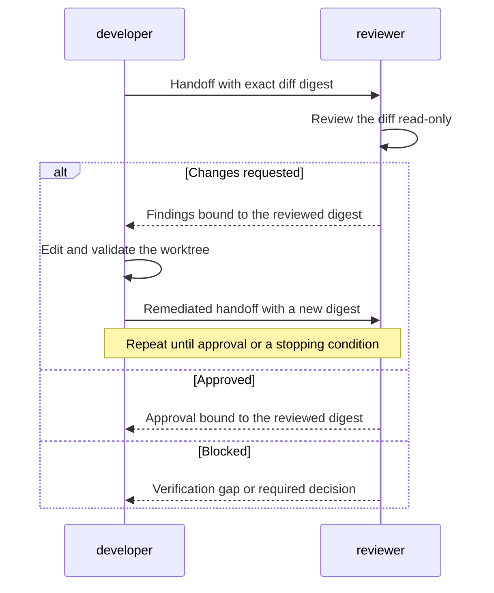

# Design

## How it works

A user invokes the CLI to have one source-code change developed and independently reviewed.
Agent-orchestra records that work as a
[job](concepts.md#jobs-tasks-and-attempts), so it can preserve the objective,
progress, and review history across task attempts.
The [orchestrator](concepts.md#system-participants) then coordinates the two
source-code roles:

1. The [source-code developer](concepts.md#roles), represented by the
   `developer` protocol role, edits and validates the assigned
   worktree, then returns a handoff.
2. The orchestrator records the exact diff digest and asks the
   [source-code reviewer](concepts.md#roles), represented by the `reviewer`
   protocol role, to evaluate that diff. The source-code reviewer works
   read-only and returns an `approved`, `changes_requested`, or `blocked`
   verdict.
3. After `changes_requested`, the orchestrator gives the complete findings to
   the source-code developer. That role addresses them, and the source-code reviewer evaluates the
   new diff. This cycle continues until approval or a stopping condition.

The sequence diagram focuses on the two agent roles. The orchestrator mediates,
validates, and durably persists every exchange shown between them.



The source-code developer and source-code reviewer communicate through versioned
[messages](concepts.md#canonical-messages-and-artifacts). A
[runtime](concepts.md#runtimes) and [adapter](concepts.md#adapters) execute each
role with only its allowed [capabilities](concepts.md#capabilities). SQLite
stores the job state, while messages, artifacts, and streams remain outside the
target worktree.

Approval applies only to the reviewed diff. Commit and publication require
separate decisions from the
[authorization authority](concepts.md#system-participants).

The current CLI implements this bounded loop for existing local changes through
the Codex and Claude Code adapters. Custom reviewer commands retain the
single-review compatibility path. See [Current scope](../README.md#current-scope)
and the [workflow contracts](workflows.md) for that boundary.

## Why SQLite

Agent-orchestra runs as an on-demand local CLI, so a separate database service
would add setup and maintenance without improving the current workflow. SQLite
provides transactions and constraints in an embedded database file. WAL mode
allows readers while a writer commits, and state-checked updates reject stale
writes after another process advances a run. This is enough for run metadata
and transition history.

Keep the database outside target worktrees so state changes do not affect the
diff under review. SQLite fits one-machine coordination; a distributed or
multi-host service would need a different storage implementation behind the
same interface.

## State transition history

One ordered transition table records state changes for both source-code and
issue-review jobs. Each row carries the opaque job ID, scenario, prior and next
state, occurrence time, and the diff or source digest current at that
transition. Job creation records an initial transition with no prior state;
every later row is inserted in the same transaction as its successful
state-checked job update.

Schema initialization migrates run-only transition rows into this shared
shape. Their transition-time digest is unknowable and remains null; current
rows must never be backfilled from a job's later digest. New transitions record
the current scope digest when one is available and otherwise keep it null. The
store exposes transition history in persistent row order through a read-only
API that neither initializes nor changes the database.

## Evidence paths and integrity

All paths beneath the configured runs directory are resolved through one
job-scoped resolver. It rejects absolute or multi-component path segments,
traversal, mismatched job identifiers, and symlinks in any existing component.
The separate workflow check that keeps the runs directory outside the reviewed
worktree remains authoritative at that boundary.

Timestamp-shaped job identifiers place evidence beneath a UTC date shard
derived only from the identifier: `YYYYMMDDTHHMMSSZ-*` resolves to
`RUNS_DIRECTORY/YYYY/MM/DD/JOB_ID/`. The resolver performs no clock, timezone,
locale, or database lookup. Identifiers without the timestamp shape resolve
directly beneath the runs directory. The configured runs directory remains the
evidence root; shards are an internal layout detail. Evidence previously written
flat under a timestamp-shaped identifier may become unreachable, and commands
report missing evidence through their normal error contract.

Each job maintains a versioned `.integrity.json` index under its job directory.
Once an atomic evidence write is renamed into place, the writer hashes the
regular file without following a final symlink and atomically replaces the
index while holding the job's integrity lock. Entries are keyed by job-relative
path and contain the job ID, evidence type, byte size, SHA-256 digest, and UTC
finalization time. Rewriting a mutable evidence location replaces its prior
entry; the index and its lock are internal metadata and do not index themselves.
Evidence types are the explicit semantic vocabulary `execution`,
`review_request`, `review_result`, `remediation_request`, `developer_handoff`,
`review_artifact`, `rejected_review_result`, `rejected_review_artifact`,
`rejected_developer_handoff`, `decision_required`, `failure`,
`invocation_record`, `process_stdout`, `process_stderr`, `issue_snapshot`,
`issue_review_request`, `issue_review_result`, and `issue_feedback`. Writers
must select one of these values; directory names, filename stems, and iteration
ordinals are not evidence types.
Before the evidence rename, the same locked protocol durably writes a pending
transaction. A later writer or resumed job reconciles that transaction, so an
exit between the evidence and index renames cannot permanently strand finalized
evidence without an entry. Existing indexes are validated strictly for schema,
job identity, required fields, unique contained paths, and scalar field types
before they may be updated.
The index-level `backfilled_at` field is null when the index originates with the
job's first native finalized write. It records the UTC discovery time when an
index is first created around existing evidence. Audit treats that marker as a
partial pre-index provenance signal rather than interpreting omitted files as
post-finalization deletion.

Process streams remain live while their child runs. Their entries are recorded
only when the corresponding invocation reaches `completed`. Integrity paths
are job-relative so a future date shard above the job directory does not alter
their identity.

## Synchronization and collision avoidance

Agents do not maintain inboxes or wait on a shared message queue. The current
orchestrator is an on-demand, synchronous CLI process. Before starting an
adapter, it atomically writes that role's complete request under the run
directory and passes the request and response paths to a newly invoked agent
process. The agent therefore starts with a message already available; it does
not poll for one. The orchestrator waits for that subprocess to exit, subject
to the role-specific positive timeout, and then validates the response file.
Stdout and stderr are logs only and are not synchronization channels.

Each accepted response determines the next dispatch. For example, a valid
`changes_requested` review is persisted before the developer process starts,
and a valid developer handoff plus a new diff digest is persisted before the
next reviewer starts. Atomic file replacement prevents consumers from seeing a
partially written request or response. Monotonic per-run sequence numbers,
unique message IDs, `in_reply_to`, iteration, and exact scope correlation make
stale or duplicate messages invalid.

If a future resident worker or independently running agent needs asynchronous
delivery, it may poll durable run state and message sequence numbers or use a
wakeup notification as an optimization. SQLite state and canonical message
files must remain authoritative: a notification alone must never advance the
workflow, and a missed notification must be recoverable by rereading durable
state.

SQLite prevents competing orchestrators from silently advancing the same run.
Every store mutation runs in a transaction. A state update uses compare-and-set
semantics: its `UPDATE` matches both the run ID and the expected current state.
The state change and its transition-history row commit together. If another
worker wins the race, the losing update affects no row and raises a concurrent
update error instead of overwriting the newer state. Primary keys prevent run
ID collisions, foreign keys protect transition ownership, and a five-second
busy timeout bounds lock contention.

WAL mode lets readers inspect status while a writer commits and allows only one
writer to commit at a time. These database guarantees protect durable run
metadata; they do not replace diff-digest checks or message validation. The
worker still freezes and verifies the exact worktree digest around every
read-only review, because SQLite cannot lock arbitrary worktree files changed
by another process.

## Principles

- Use an on-demand CLI and SQLite instead of a resident service.
- Keep agent, Git provider, and worktree operations behind typed interfaces.
- Review an immutable diff digest; any code change invalidates approval.
- Store structured findings and render Markdown as a human-readable artifact.
- Treat committing and publishing as separate, explicit authorization gates.
- Preserve worktrees and changes that the orchestrator does not own.
- Make every workflow transition durable and resumable.
- Separate agent roles from the runtimes that execute them.
- Grant capabilities by registered role and fail closed for unknown roles.

These choices optimize for local agents and minimum resource use. Python is the
preferred implementation language, with a toolchain based on uv, Ruff, and
mise.

## Job ID format

The [job ID](concepts.md#jobs-tasks-and-attempts) has the form
`{UTC timestamp}-{random hex}`, such
as `20260902T130000Z-a7f3c921`. The timestamp makes IDs sortable, and the random
suffix avoids collisions. Consumers treat IDs as opaque strings so older
UUID-based runs remain readable.

## Job and task output

CLI output schema version 10 uses the public `job` -> `task` -> `attempt`
hierarchy. The `jobs`, `job`, `tasks`, and `task` commands are separate
read-only views. `job.current` is always an array and contains only pending or
running tasks. Completed work remains in `tasks` history. Attempt output uses
`attempt_id` and embeds separately captured stdout and stderr streams.

The SQLite tables and canonical evidence retain their implementation-level
column and field names. Those names are not exposed by the schema-13 CLI. This
keeps storage mechanics separate from the public vocabulary without adding
compatibility aliases to the command surface.

Schema version history:

- Version 7 exposed the former `status` and `logs` documents with `run_id`,
  `runs`, and `invocation_id` fields.
- Version 8 replaces those commands with `jobs`, `job`, `tasks`, and `task`,
  and exposes `job_id`, `jobs`, and `attempt_id`. Stored SQLite columns and
  canonical evidence keep their implementation-level field names.
- Version 9 adds issue-review jobs, the `issue_review` scenario, and recorded
  provider actions to the job and task views.
- Version 10 adds deterministic audit documents, ordered transitions, integrity
  verification, aggregated findings, and the optional verification result.
- Version 11 reports unrecognized persisted job enum values through stable
  query errors and retains unrecognized transition values as unverifiable audit
  findings.
- Version 12 adds effective global settings, explicit retention planning and
  application documents, and the `expired` audit result.
- Version 13 adds source-job worktree health, explicit cancellation, and
  cancellation reasons on transition documents.

A source-code job's worktree binding is durable and may outlive the directory
it names. Read paths observe whether that path is absent or no longer a Git
worktree without mutating state. Only the explicit cancellation command may
close such a job; evidence remains governed by retention.

Persisted state and scenario strings are widened through shared defensive
decoders. A job row with an unrecognized value produces a stable query error;
list views retain that row as an error entry. Transition history retains raw
unrecognized values so audit can report the affected entry without discarding
the rest of the history. The historical `awaiting_review` state is normalized
to `reviewing` only at the read sites that already accepted it.

## Batch enqueue output

`enqueue-locals` prints one versioned JSON document. Its `directory` identifies
the scanned parent, `jobs` lists enqueued job IDs and absolute worktree paths in
repo-basename order, and `summary` contains numeric `enqueued`, `clean`, and
`failed` counts. Independent repo failures appear in `failures` with their
source path and diagnostic. A command-level failure uses the top-level `error`
object; successful and completed partial scans set `error` to `null`.

This JSON is CLI output rather than a workflow message. Callers must use the
declared schema version and treat job IDs as opaque strings.

## Issue-review source and messages

Issue review uses contracts distinct from diff-scoped code review. A captured
`issue.json` schema version 1 contains provider, host, canonical URL, namespace,
project, provider issue number, title, body, author, labels, state, provider
timestamps, and `source_digest`. The digest is canonical JSON SHA-256 over the
normalized title, body, ordered labels, and state. Provider-only response fields
are not retained as workflow state.

An `issue_review_request` schema version 1 contains:

| Field | Meaning |
|---|---|
| `job_id` / `iteration` | Durable job identity and positive review iteration. |
| `objective` | Human review objective. |
| `allowed_actions` | Only `read_issue_snapshot` and `write_review_evidence`. |
| `source` | Complete validated provider-neutral issue snapshot. |
| `prior_review` | Previous canonical result for disposition, or null. |

An issue-review result schema version 1 contains the exact `source_digest`, a
`ready`, `changes_requested`, or `blocked` verdict, summary, findings,
validation, and verification gaps. Each finding has a unique ID, one readiness
dimension, severity, title, optional issue section or field, explanation, and
suggested change. `ready` forbids findings and `changes_requested` requires at
least one.

Before the first review, the live provider digest and `updated_at` must match
the captured source. Before accepting every result, both values are fetched
again and must match the request. A later iteration requires a different
review-relevant digest and includes the prior result. Requests, snapshots,
results, and rendered Markdown are stored under
`iterations/{iteration:06d}/` outside target repos.

Issue review grants no provider-write capability. The separate
`post-issue-feedback --authorize` operation re-fetches and verifies the reviewed
revision before posting. It stores the provider message identity in
`issue_actions`; a hidden job, iteration, and digest marker recovers an existing
comment or note when a retry follows an interrupted local persistence step.

## Message representation

Agent-orchestra messages are versioned JSON documents encoded as UTF-8. JSON is
the canonical machine contract for assignments, handoffs, review feedback,
authorization decisions, and operation results. Markdown is a human-readable
artifact generated from structured JSON; it is never parsed to recover workflow
state or findings.

Each message is stored as one file rather than mixed into process output:

```text
{runs-directory}/
└── {run-id}/
    ├── messages/
    │   ├── 000001-development-assignment.json
    │   ├── 000002-developer-handoff.json
    │   ├── 000003-review-request.json
    │   └── 000004-review-result.json
    └── artifacts/
        └── review-0001.md
```

The tree illustrates the target end-to-end lifecycle. The six-digit filename
prefix is the message's `sequence`. The current review-only implementation does
not emit the initial development pair, so its first review request and result
are `000001-review-request.json` and `000002-review-result.json`. Later
remediation and review messages continue the same monotonically increasing
sequence.

The runs directory is outside the target worktree, so writing workflow evidence
cannot change the diff under review.

The orchestrator writes a request to a temporary file, flushes it, and renames
it into `messages/` atomically. The agent adapter receives the request path and
an expected response path. It translates the JSON request into the invocation
format required by Codex or Claude Code. The response is also written
atomically, validated, and accepted before the workflow state changes.

Agent process stdout and stderr are retained as execution logs only. They may
contain progress text or vendor diagnostics and are never parsed as the message
response. This prevents conversational output from corrupting the protocol.

The first local review step implements this file transport for its request and
response. Other lifecycle messages remain a target contract. See
[Current scope](../README.md#current-scope) for the implementation boundary.

## JSON envelope

Every message uses the same top-level envelope:

```json
{
  "schema_version": 1,
  "message_id": "3bfc3f23-c25a-4b62-a7bf-610a54206f53",
  "in_reply_to": null,
  "run_id": "20260902T130000Z-a7f3c921",
  "sequence": 1,
  "iteration": 1,
  "message_type": "development_assignment",
  "sender": "orchestrator",
  "recipient": "developer",
  "created_at": "2026-09-02T13:00:00Z",
  "scope": {
    "worktree_path": "/absolute/path/to/worktree",
    "base_sha": "0123456789abcdef",
    "head_sha": "fedcba9876543210",
    "diff_digest": "sha256:5ca1ab1e..."
  },
  "payload": {}
}
```

Envelope fields have these meanings:

| Field | Contract |
|---|---|
| `schema_version` | Integer version of the JSON message schema. Version 1 is the initial contract. |
| `message_id` | Globally unique UUID for idempotency and audit history. |
| `in_reply_to` | Request `message_id` answered by this message, or `null` for an initiating message. |
| `run_id` | Persistent repo-independent UTC timestamp and random identifier. |
| `sequence` | Monotonically increasing message number within the run. |
| `iteration` | Positive workflow iteration. It is `1` for the initial development exchange and first review, then increases for each repeat review. |
| `message_type` | One of the message types defined below. |
| `sender` / `recipient` | `orchestrator`, `developer`, `reviewer`, `user`, or `provider_adapter`. |
| `created_at` | UTC RFC 3339 timestamp. |
| `scope` | Absolute worktree path and immutable Git/diff identity applicable to the message. |
| `payload` | Message-specific object. Unknown fields are rejected for the declared schema version. |

`base_sha` and `head_sha` are full Git object IDs. `diff_digest` uses the form
`sha256:{hex-digest}` and identifies the exact tracked and untracked change set.
Fields that do not yet apply are `null`; they are not omitted. Paths are
absolute so an agent invocation cannot silently depend on its current working
directory.

## Message payloads

The flow, purpose, and payload for each message type are explicit:

| Message type | Flow | Purpose | Required payload fields |
|---|---|---|---|
| `development_assignment` | Orchestrator to developer | Implement the initial objective. | `objective`, `allowed_actions`, `timeout_seconds` |
| `developer_handoff` | Developer to orchestrator | Report readiness, changes, validation, and risks. | `status`, `summary`, `files_changed`, `validation`, `dispositions`, `remaining_risks` |
| `review_request` | Orchestrator to reviewer | Review one exact diff digest. | `objective`, `allowed_actions`, `timeout_seconds`, `artifact_path`, `prior_review_path` |
| `review_result` | Reviewer to orchestrator | Return the verdict, findings, evidence, and artifact. | `verdict`, `summary`, `findings`, `validation`, `verification_gaps`, `artifact_path` |
| `remediation_request` | Orchestrator to developer | Deliver an accepted review and request remediation. | `objective`, `review_result_path`, `review_artifact_path`, `allowed_actions`, `timeout_seconds` |
| `authorization_request` | Orchestrator to user | Request one commit or remote action. | `action`, `action_parameters`, `reason`, `expires_at` |
| `authorization_decision` | User to orchestrator | Allow or deny the requested action. | `approved`, `action`, `decided_by`, `reason` |
| `operation_result` | Developer or provider adapter to orchestrator | Report an authorized operation's outcome. | `action`, `status`, `identifiers`, `summary`, `errors` |

### Development assignment example

The target initial-development flow begins with a
`development_assignment`. The current local-review implementation does not yet
emit this message; it starts with the review request shown below.

```json
{
  "schema_version": 1,
  "message_id": "a95ee61d-cff8-4698-9764-e3f58b89042d",
  "in_reply_to": null,
  "run_id": "20260904T140000Z-3b5d8e21",
  "sequence": 1,
  "iteration": 1,
  "message_type": "development_assignment",
  "sender": "orchestrator",
  "recipient": "developer",
  "created_at": "2026-09-04T14:00:00.123456Z",
  "scope": {
    "worktree_path": "/Users/example/Projects/example-worktree",
    "base_sha": "565a4fc6598b1fc53053b0f952f7f4cbc369630b",
    "head_sha": "565a4fc6598b1fc53053b0f952f7f4cbc369630b",
    "diff_digest": "sha256:60e068bb54036e30667689b3471e47346a7dd782fcd1104147da8b467ce3798a"
  },
  "payload": {
    "objective": "Add the resolved default evidence root to successful status output.",
    "allowed_actions": [
      "edit_worktree"
    ],
    "timeout_seconds": 1800
  }
}
```

`in_reply_to` is `null` because this assignment initiates the development
exchange. `iteration` is `1`, the first positive workflow iteration required by
the canonical envelope, even though review has not started. The capability list
permits worktree edits only; it does not authorize a commit or remote action.

### Developer handoff example

The developer answers the assignment with a correlated `developer_handoff`:

```json
{
  "schema_version": 1,
  "message_id": "3671ceff-5e48-4d56-a790-fe7bd795248a",
  "in_reply_to": "a95ee61d-cff8-4698-9764-e3f58b89042d",
  "run_id": "20260904T140000Z-3b5d8e21",
  "sequence": 2,
  "iteration": 1,
  "message_type": "developer_handoff",
  "sender": "developer",
  "recipient": "orchestrator",
  "created_at": "2026-09-04T14:08:30.654321Z",
  "scope": {
    "worktree_path": "/Users/example/Projects/example-worktree",
    "base_sha": "565a4fc6598b1fc53053b0f952f7f4cbc369630b",
    "head_sha": "565a4fc6598b1fc53053b0f952f7f4cbc369630b",
    "diff_digest": "sha256:60e068bb54036e30667689b3471e47346a7dd782fcd1104147da8b467ce3798a"
  },
  "payload": {
    "status": "ready_for_review",
    "summary": "Status now reports the resolved default evidence root.",
    "files_changed": [
      "docs/cli.md",
      "src/agent_orchestra/cli.py",
      "tests/test_cli.py"
    ],
    "validation": [
      {
        "command": "mise run tests",
        "outcome": "passed"
      },
      {
        "command": "git diff --check",
        "outcome": "passed"
      }
    ],
    "dispositions": [],
    "remaining_risks": []
  }
}
```

The handoff's `in_reply_to` identifies the assignment. Its `run_id`,
`iteration`, and assigned `scope` remain correlated with that request. An
initial-development handoff has no prior review findings, so `dispositions` is
empty. A remediation handoff instead includes exactly one disposition for every
finding in the accepted review result.

### Review request example

The orchestrator persists the first review request as
`messages/000001-review-request.json` before starting the reviewer:

```json
{
  "schema_version": 1,
  "message_id": "c0361bbe-23bb-43bf-9165-3dfa61de0d74",
  "in_reply_to": null,
  "run_id": "20260904T154448Z-59feda56",
  "sequence": 1,
  "iteration": 1,
  "message_type": "review_request",
  "sender": "orchestrator",
  "recipient": "reviewer",
  "created_at": "2026-09-04T15:44:59.123456Z",
  "scope": {
    "worktree_path": "/Users/example/Projects/example-worktree",
    "base_sha": "565a4fc6598b1fc53053b0f952f7f4cbc369630b",
    "head_sha": "565a4fc6598b1fc53053b0f952f7f4cbc369630b",
    "diff_digest": "sha256:f7a13788f3fab6b87f3d61ea63b57431a2e8b47dc6b004792027fb1196f33f87"
  },
  "payload": {
    "objective": "Review the exact current diff for correctness and contract compatibility.",
    "allowed_actions": [],
    "timeout_seconds": 1800,
    "artifact_path": "/Users/example/.local/state/agent-orchestra/runs/20260904T154448Z-59feda56/artifacts/review-0001.md",
    "prior_review_path": null
  }
}
```

`in_reply_to` is `null` because the request initiates this exchange.
`allowed_actions` is empty because review is read-only. On a repeat review,
`prior_review_path` identifies the preceding accepted review-result message.

### Review result example

After validating the reviewer response, the orchestrator persists the complete
result as `messages/000002-review-result.json`:

```json
{
  "schema_version": 1,
  "message_id": "56fd1536-5ffb-45ef-b8c7-64002c5a5b34",
  "in_reply_to": "c0361bbe-23bb-43bf-9165-3dfa61de0d74",
  "run_id": "20260904T154448Z-59feda56",
  "sequence": 2,
  "iteration": 1,
  "message_type": "review_result",
  "sender": "reviewer",
  "recipient": "orchestrator",
  "created_at": "2026-09-04T15:46:12.654321Z",
  "scope": {
    "worktree_path": "/Users/example/Projects/example-worktree",
    "base_sha": "565a4fc6598b1fc53053b0f952f7f4cbc369630b",
    "head_sha": "565a4fc6598b1fc53053b0f952f7f4cbc369630b",
    "diff_digest": "sha256:f7a13788f3fab6b87f3d61ea63b57431a2e8b47dc6b004792027fb1196f33f87"
  },
  "payload": {
    "verdict": "changes_requested",
    "summary": "The diff is established, but one contract defect must be corrected.",
    "findings": [
      {
        "finding_id": "F-001",
        "severity": "medium",
        "title": "CLI schema version was not advanced",
        "path": "src/agent_orchestra/cli.py",
        "line": 37,
        "explanation": "A required output field was added without changing the strict CLI schema version.",
        "acceptance_criterion": "Advance the CLI schema version and update every affected test and documented example."
      }
    ],
    "validation": [
      "Inspected the complete tracked and untracked diff.",
      "Ran git diff --check successfully."
    ],
    "verification_gaps": [],
    "artifact_path": "/Users/example/.local/state/agent-orchestra/runs/20260904T154448Z-59feda56/artifacts/review-0001.md"
  }
}
```

The result's `in_reply_to` matches the request's `message_id`; its `run_id`,
`iteration`, and complete `scope` match the request exactly. A
`changes_requested` result contains at least one finding. An `approved` result
uses an empty `findings` array.

`allowed_actions` is an array of exact capabilities such as `edit_worktree` or
`commit`. It is not an open-ended permission string. Commit, push, pull-request
creation, remote review posting, merge, and cleanup are separate values and
separate authorization decisions.

Validation entries use this shape:

```json
{
  "command": "mise run tests",
  "outcome": "passed"
}
```

Review findings use this shape:

```json
{
  "finding_id": "F-001",
  "severity": "high",
  "title": "Approval does not match the current diff",
  "path": "src/agent_orchestra/workflow.py",
  "line": 72,
  "explanation": "The digest changed after approval.",
  "acceptance_criterion": "Return the run to review before committing."
}
```

Finding IDs are stable within a review result. A later `developer_handoff`
communicates feedback disposition without rewriting the finding:

```json
{
  "finding_id": "F-001",
  "disposition": "addressed",
  "rationale": "Approval invalidation now requires a new digest."
}
```

`review_result_path` names the complete canonical JSON result accepted by the
orchestrator; `review_artifact_path` names its human-readable Markdown artifact.
Both paths must resolve inside the run directory. A developer disposition is
required exactly once for every finding ID and uses `addressed`, `rejected`, or
`blocked`.

Terminal worker failures are written atomically to `failure.json` in the run
directory. The version 1 record contains the run ID, resulting durable state,
timestamp, and an error object with a message and machine-readable code. The
code preserves a specific stable worker error code when one is available and
otherwise uses `worker_error`. Rejected agent responses remain in `logs/`;
neither stderr nor a rejected response is the sole failure record.
If a developer rejects or blocks every accepted finding without changing the
diff, the valid handoff is preserved and the run returns to
`changes_requested`. A `decision-required.json` record with the stable
`developer_disagreement` reason makes the reviewer/developer disagreement a
human decision rather than a failed or endlessly retried run.

## External process contract

Every runtime is launched through one bounded process helper that tees the child
streams live, applies the invocation deadline, writes the prompt to the child's
standard input, and then closes it.

Closing standard input is required. A runtime that reads standard input blocks
until end of file, and Codex reads it whenever it is a non-TTY pipe even when
the prompt is supplied as a command argument, so leaving the pipe open deadlocks
the child until its timeout expires rather than failing. The single stderr line
the runtime prints in that state is also printed on success, so it does not
distinguish a hang from normal operation. See openai/codex#20919.

A runtime added later inherits this behavior by launching through the same
helper. Spawning a runtime directly bypasses the closing guarantee together with
the stream tee, the timeout controller, and attempt evidence capture.

## Invocation evidence and logs

Every attempted external process writes one versioned JSON record under the
run's `invocations/` directory. The record is runtime-neutral and contains the
run, task, and invocation IDs; role; selected agent vendor; requested model override;
effective model identities and reporting status, adapter runtime, iteration,
start and finish timestamps, exit code, timeout and interruption flags, attempt
number, explicit attempt `status` and `conclusion`, response and validation
milestones, and paths to separate stdout and stderr files under `logs/`.
Schema version 4 adds a stable task ID shared by retry attempts and separates
attempt progress (`pending`, `running`, `completed`) from its terminal conclusion.
Task IDs use the `<run_id>:<sequence>-<role>` form, such as
`20260907T090000Z-a7f3c921:000003-developer`; invocation IDs append the attempt
ordinal, such as `20260907T090000Z-a7f3c921:000003-developer:attempt-0002`.
These typed layers deliberately reuse familiar values such as `failed`,
`cancelled`, and `interrupted`: an attempt conclusion describes process execution,
developer status and reviewer verdict describe protocol messages, and `RunState`
alone controls workflow progression.
Schema version 3 separates `requested_model` from the ordered
`effective_models` collection. `effective_model_status` is `reported` only when
stable machine-readable runtime metadata supplied at least one identity;
otherwise it is `unavailable`. The orchestrator never guesses from a runtime
default or parses human-formatted output. Invocation-record schemas 1-3 are no
longer readable because their lifecycle cannot be established without guessing;
historical runs that need structured invocation evidence must be recreated.
Records and streams are written atomically. Invocation records exclude command
arguments and environment snapshots.

New runs also persist `execution.json` schema version 2 before their first
agent invocation. It contains the run ID, objective, exact reviewer and
developer commands, declared agent identities, role-specific timeouts,
iteration limit, and creation timestamp. These are the durable inputs used by
`resume`; older execution schemas remain historical evidence but are not
sufficient to restart an agent safely. A retry keeps the original request
message and writes a new invocation record with the same `task_id`, a new
`invocation_id`, and an incremented `attempt`. A task has no separately persisted
state: no or pending latest attempt derives `pending`, a running latest attempt
derives `running`, and a completed latest attempt derives `completed` until a
new retry attempt is durably created. Recovery validates existing invocation
evidence before leaving a recoverable state, then persists the next request and
pending invocation record before activating the role and launching its process.
A durable recovery request with a persisted `pending` attempt is not relaunched
because activation cannot be established safely. Because the configured command
is persisted for recovery, callers must not place secrets in command-line
arguments. Environment snapshots remain excluded.

Recovery follows durable evidence rather than assuming that a missing update
means a process never started:

| Boundary | Authoritative evidence | Recovery action | Duplicate-activation rule |
|---|---|---|---|
| Request persisted; no attempt | Canonical request and no task attempt | Create and launch attempt 1. | Write `pending` first. |
| `pending`; activation did not start | `pending`; no durable activation fact | Fail as activation-uncertain. | Do not launch. |
| Activation started; `running` missing | Indistinguishable durable `pending` evidence | Fail as activation-uncertain. | Do not launch. |
| `running`; no response | Running attempt without response evidence | Fail as activation-uncertain. | Do not launch. |
| Response exists; timestamp missing | Response artifact plus running attempt | Persist the response timestamp, then validate. | Never relaunch. |
| Response timestamp; validation missing | Running attempt with response timestamp | Start validation. | Never relaunch. |
| Validation started; completion missing | Running attempt with both milestones | Repeat idempotent validation and complete. | Never relaunch. |
| Completion; run transition missing | Immutable completed attempt | Apply its conclusion to the workflow. | Never relaunch. |

Only a completed prior attempt permits creation of a numbered retry. A pending
or running latest attempt fails with a stable diagnostic because its activation
may still be live.

Built-in adapters tee their underlying Codex or Claude process streams through
the wrapper's stdout and stderr while retaining the text needed for structured
result parsing and diagnostics. Because the worker redirects those wrapper
streams before launch, child output is durable as it arrives and output written
before a timeout or nonzero exit remains available. If a reviewer attempt is
interrupted, any artifact it produced is moved to an attempt-qualified file in
`logs/`; the retry must produce the canonical artifact again before its result
can be accepted.

`task TASK_ID` is the read-only public view over attempt evidence. It resolves
the parent job from the task ID, groups all numbered attempts, and returns each
attempt's separate stdout and stderr stream objects. Every path must resolve
beneath the configured evidence root and match the selected job; traversal,
symlink escape, and malformed metadata fail closed. The public attempt object
uses `attempt_id`; the persisted invocation identifier remains an internal
evidence detail.

## Request and response validation

Before invoking an agent, the orchestrator validates the complete request
against the versioned schema. Before accepting a response, it verifies all of
the following:

1. `schema_version` and `message_type` are supported.
2. `in_reply_to` names the exact request message.
3. `run_id`, `iteration`, recipient role, and diff scope match the request.
4. The response message ID and sequence have not already been accepted.
5. Every required payload field is present and no unknown field is present.
6. Every artifact path stays inside the run artifact directory.
7. An `approved` review result contains no actionable findings.
8. A changed worktree digest invalidates the response before any state
   transition or authorized side effect.

Invalid JSON, schema violations, stale digests, duplicate messages, and path
escapes are recorded as protocol failures. They are not repaired by guessing at
the agent's intent.

## Lifecycle

A run state is the stored step of the workflow. The current lifecycle defines
these states:

| State | Meaning |
|---|---|
| `queued` | The run was accepted but preparation has not started. |
| `preparing` | The orchestrator is resolving instructions, worktree state, and the exact diff. |
| `developing` | A developer is implementing the objective or remediating findings. |
| `validation_required` | A valid developer handoff reported blocked or failed work; the remediation can be retried after intervention. |
| `reviewing` | A reviewer is evaluating an immutable diff or issue snapshot, or its result is being validated. |
| `changes_requested` | A valid review found actionable defects and the job awaits remediation or issue revision. |
| `approved` | A valid review approved the exact recorded diff or issue-source digest. |
| `awaiting_commit_authorization` | The approved digest is waiting for explicit commit authorization. |
| `committed` | The approved change was committed but has not been authorized for publication. |
| `awaiting_publish_authorization` | The commit is waiting for explicit push and pull-request authorization. |
| `published` | The authorized publication operation completed. |
| `failed` | The run stopped after a non-resumable protocol or execution failure. |
| `cancelled` | An authorized caller intentionally stopped the run without discarding its evidence or worktree. |
| `interrupted` | Execution stopped before completing a step and may resume through an allowed transition. |
| `superseded` | The review scope became stale, such as when a remote pull-request head changed. |

A review verdict is the outcome of one review iteration, not the run's durable
state:

| Verdict | Effect on the run |
|---|---|
| `approved` | Moves a matching `reviewing` run to the `approved` state. |
| `changes_requested` | Moves a matching `reviewing` run to the `changes_requested` state. |
| `blocked` | Records that the review could not establish its scope or required evidence; there is no `blocked` run state. |

The repeated names `approved` and `changes_requested` are distinct typed values:
one is a review verdict and the other is the resulting run state. Documentation
qualifies them when the distinction matters.

```text
queued
  -> preparing
     -> developing -> reviewing
     -> reviewing
        -> changes_requested -> developing
           -> validation_required -> developing
           -> reviewing
        -> approved
           -> awaiting_commit_authorization
           -> committed
           -> awaiting_publish_authorization
           -> published
```

Active states may also become `failed`, `interrupted`, `cancelled`, or
`superseded` where allowed by the workflow contract.

`resume` is accepted from `interrupted`, `validation_required`, and conditionally
from `reviewing`, `developing`, `approved`, and `changes_requested`. Active runs
recover only when durable task-attempt evidence makes the next action
unambiguous; uncertain activation fails closed. Intermediate approval advances
only when its accepted result and exact diff still match. Changes-requested
recovery requires an accepted result, configured developer, remaining iteration,
and a durable or safely reconstructible remediation request. An interrupted
reviewer or developer repeats the unanswered durable request only after the
prior attempt has a terminal conclusion. A
validation-required run creates the next correlated remediation request and
retries the developer. Canonical messages and the run ID are retained; only
invocation-attempt evidence is appended. Timeout and user interruption enter
`interrupted`; malformed protocol evidence, invalid execution metadata,
nonzero process exits, and other non-recoverable failures enter `failed`.

When a failed or superseded job truly cannot continue, a caller may enqueue a
new job with `--supersedes JOB_ID`. The new job stores that lineage link. The
old evidence is never copied or rewritten, and recoverable jobs cannot be
replaced through this escape hatch.

Approval is tied to the reviewed digest. If the diff changes after approval or
while waiting for commit authorization, the run returns to `reviewing`
with a new digest and review iteration.
