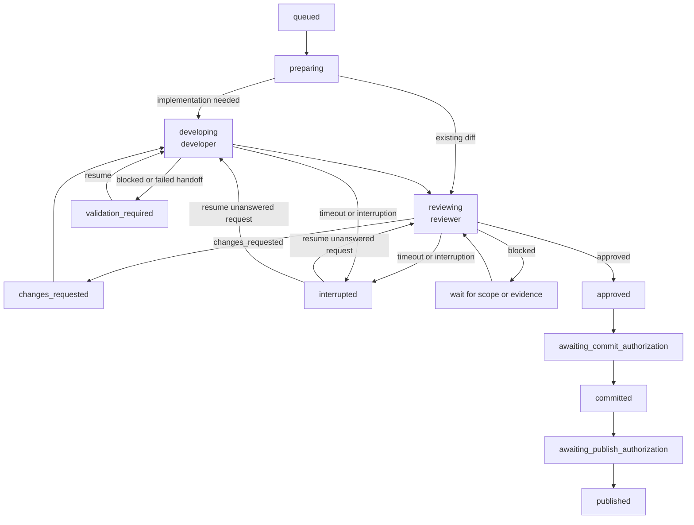

# Workflow contracts

This document defines the supported orchestration scenarios. It uses the
[role model](concepts.md), [source-code developer](role-developer.md) and
[source-code reviewer](role-reviewer.md) contracts, and
[message and lifecycle contract](design.md).

The local development and review and issue-refinement workflows are
implemented. Issue feedback uses a separate authorized publication command;
the remote pull-request workflow remains a target design. See
[Current scope](../README.md#current-scope) for the exact implementation
boundary.

Both implemented workflows can be reconstructed locally with the read-only
[`audit`](cli.md#audit) command. Optional verification checks transition scope,
canonical evidence correlation, containment, and finalized hashes without
contacting a source-code host or issue provider. Active process streams remain
visible as `in_progress` metadata and their contents are not embedded.

## Local development and review

This workflow covers both a worktree that already has uncommitted changes and
a worktree in which agent-orchestra first asks a source-code developer to implement an
objective.

1. **Enqueue the worktree.** The user or calling process runs `enqueue-local`,
   or runs `enqueue-locals` on a directory whose immediate children are repos.
   The CLI resolves `HEAD`, computes a SHA-256 identity from the binary tracked
   diff and untracked file paths and contents, creates a `local_changes` job in
   the `queued` state, and returns the job ID. A clean worktree is rejected.
   The command does not commit, stash, reset, or clean anything.

2. **Prepare the job.** The orchestrator moves the job to the `preparing`
   state, reads applicable repo instructions, records the existing worktree
   state, and confirms that the worktree and changes can be preserved. It
   recomputes and records the current digest if the worktree changed since
   enqueueing; the review request preserves that new scope durably. A missing
   or ambiguous worktree produces a blocked or failed result without mutation.

3. **Obtain a source-code developer handoff.** If implementation is still required, the
   orchestrator moves the job to the `developing` state and sends a
   `development_assignment` containing the objective, worktree, iteration,
   timeout, and allowed actions. The developer edits only the assigned
   worktree, validates the result, and returns a `developer_handoff`. If the
   worktree was supplied with completed uncommitted changes, the orchestrator
   skips the initial developer attempt and treats those changes as the
   handoff.

4. **Freeze the source-code review identity.** Immediately before review, the orchestrator
   recomputes the diff digest. It records the current base SHA, head SHA, and
   digest, moves the job to the `reviewing` state, and increments the
   review iteration. The digest is the approval boundary; the worktree itself
   is not assumed to remain unchanged.

5. **Send the review request.** The orchestrator sends a `review_request` with
   the objective, worktree, iteration, allowed actions, timeout, base SHA, head
   SHA, diff digest, and Markdown artifact path. The source-code reviewer confirms that the
   current diff still matches the request and performs a read-only review. A
   mismatch returns a `blocked` verdict instead of reviewing a different
   change.

6. **Return and record feedback.** The source-code reviewer returns a `review_result` with
   an `approved`, `changes_requested`, or `blocked` verdict; the reviewed
   digest; summary; ordered findings; validation evidence; and remaining
   verification gaps. It also writes the Markdown artifact to the requested
   path. The orchestrator verifies that the result names the requested job,
   iteration, and digest before accepting it.

7. **Remediate requested changes.** After a `changes_requested` verdict, the
   job enters the `changes_requested` state and then returns to `developing`.
   The orchestrator sends a `remediation_request` containing the original
   objective and paths to the complete canonical review result and Markdown
   artifact. The developer evaluates every
   finding, makes justified changes, and returns a new `developer_handoff` with
   each finding's disposition. The orchestrator computes a new digest and
   repeats steps 4-7. A valid `blocked` or `failed` handoff enters
   `validation_required`; after the external obstacle is resolved, `resume`
   appends a correlated remediation request and retries the developer within
   the same job. If every finding is instead rejected or blocked with a
   rationale and the diff is unchanged, the job returns to `changes_requested`
   with durable decision-required evidence for human resolution. Review
   iterations are bounded; exhausting the configured
   limit fails the job instead of looping forever.

8. **Handle blocked or failed work.** A blocked review remains unresolved until
   its missing scope, evidence, or decision is supplied. Timeouts and user
   interruptions enter `interrupted`; `resume` reuses the unanswered canonical
   request and appends a numbered attempt. Protocol-invalid
   evidence, nonzero process exits, and other non-recoverable errors enter
   `failed`. Resume validates the saved schema version, message chain, original
   role configuration, and diff scope before it changes state or launches an
   agent.

9. **Accept approval for one digest.** After an `approved` verdict, the
   orchestrator records it and moves the job to the `approved` state. It
   recomputes the digest before any commit action. If the worktree changed,
   approval is invalidated, the job returns to `reviewing` with a new
   iteration, and no commit is made.

10. **Request commit authorization.** The job moves to
    `awaiting_commit_authorization`, and the orchestrator sends an
    `authorization_request` describing the exact digest and proposed commit.
    Denial cancels the action without discarding the worktree. Approval permits
    only the commit; it does not permit a push or pull request.

11. **Commit and request publication separately.** After a successful commit,
    the job moves through `committed` to `awaiting_publish_authorization`. A
    second `authorization_request` names the proposed push and pull-request
    operation. On approval, the authorized developer or provider adapter
    publishes and returns an `operation_result` with the branch, commit, and
    pull-request identity. The job becomes `published`. Denial leaves the local
    commit intact and unpublished.

12. **Finish without destructive cleanup.** Completion reports the final job
    state and artifact locations. Worktree removal, branch deletion, merging,
    and remote cleanup are separate actions and require their own safety checks
    and authorization.

A terminal `failed` or `superseded` job may be followed by an exceptional new
enqueue using `--supersedes JOB_ID`. The new job records its predecessor, but
does not copy or rewrite prior evidence. `interrupted` and
`validation_required` jobs must use `resume` instead so iterative work stays
under one job ID.

## Issue refinement

This workflow reviews issue prose without requiring a local repo or Git diff.
The [issue reviewer](role-issue-reviewer.md) produces readiness findings; the
[issue creator](role-issue-creator.md) responds by revising the issue prose.
Neither responsibility is the source-code reviewer or source-code developer
used by the local-development workflow. Agent Orchestra currently dispatches
the issue reviewer; a person or external system performs the issue-creator
work.

1. **Capture the issue.** `enqueue-issue ISSUE_URL` accepts canonical GitHub
   and GitLab URLs. GitLab URLs may contain nested namespaces and may target a
   self-managed host configured for `glab`. The provider CLI performs the
   authenticated read, including for accessible private projects.
2. **Normalize and freeze the source.** The orchestrator stores provider, host,
   namespace, project, issue number or IID, canonical URL, title, body, labels,
   state, author, timestamps, and a SHA-256 digest of the review-relevant
   normalized fields outside any target repo.
3. **Start a read-only review.** `review-issue JOB_ID` re-fetches the issue and
   rejects the review if the initially captured revision changed. It writes a
   versioned issue-review request, increments the iteration, and dispatches
   either the Codex or Claude Code implementation of the same abstract adapter.
4. **Evaluate readiness.** The issue reviewer evaluates problem clarity, scope,
   constraints, dependencies, risks, acceptance criteria, testability, and
   implementation readiness. Findings identify an issue section or field, not
   a fabricated source path or line.
5. **Accept only a current result.** The result echoes the source digest. The
   orchestrator re-fetches the issue after execution and rejects the result if
   either the digest or provider update timestamp changed.
6. **Persist feedback.** Canonical JSON and rendered Markdown are stored under
   the iteration evidence directory. `ready` moves the job to `approved`,
   `changes_requested` waits for an issue-creator revision, and `blocked` fails closed.
7. **Review a revision.** Running `review-issue` again requires a changed source
   digest. The next request includes the prior result for disposition and
   preserves every earlier iteration.

`post-issue-feedback JOB_ID --authorize` re-fetches the issue, rejects a stale
revision, and posts the accepted Markdown as a GitHub comment or GitLab note. A
hidden marker and persisted provider response identity make retries idempotent.

## Remote pull-request review

This workflow reviews a remote pull request at an exact head without changing
the source branch. Provider integration and pull-request enqueueing are not yet
implemented.

1. **Enqueue the pull-request URL.** The caller submits a GitHub or GitLab URL.
   The orchestrator validates the provider and project identity, stores the
   canonical URL, creates a `pull_request` job in the `queued` state, and
   returns its job ID. URL parsing does not post to the provider.

2. **Resolve live pull-request metadata.** In `preparing`, the provider adapter
   reads the pull-request identifier, target branch and SHA, source branch and
   exact head SHA, current state, and relevant repo location. Authentication or
   lookup failures return a blocked or failed result with the provider
   diagnostic.

3. **Create an exact-head review worktree.** The orchestrator fetches the
   recorded remote head and creates or reuses an isolated detached review
   worktree according to the repo's worktree rules. It verifies that the local
   head equals the provider-reported head. It never reviews the caller's main
   worktree or checks out the contributor branch in place.

4. **Freeze the remote review scope.** The orchestrator computes the exact
   target-to-head diff and digest, records the base SHA, head SHA, and digest,
   moves the job to `reviewing`, and increments the iteration. The URL
   alone is never treated as an immutable review target.

5. **Send the review request.** The `review_request` contains the objective and
   URL, detached worktree, iteration, timeout, base SHA, head SHA, diff digest,
   and artifact path. `allowed_actions` is empty for the reviewer. The reviewer
   may run safe read-only validation but does not edit, commit, push, post a
   review, approve remotely, or merge.

6. **Detect concurrent updates.** Before accepting the result, the orchestrator
   reads the live head again and recomputes the local digest. If either differs
   from the request, the result is stale and is not published. The job becomes
   `superseded`; the new head must be enqueued as a new job and review scope.

7. **Return the local review result.** For an unchanged head, the reviewer
   returns a `review_result` with the exact reviewed head and digest, verdict,
   structured findings, validation, and Markdown artifact. The orchestrator
   stores the result and presents it to the caller. An `approved` verdict means
   only that the reviewed diff has no actionable findings; it is not provider
   approval or merge authorization.

8. **Publish feedback only when authorized.** By default, feedback remains a
   local artifact. Posting a comment, submitting a provider review, or setting
   an approval state requires an `authorization_request` naming the exact
   provider action and reviewed head. If allowed, the provider adapter posts
   the structured result and returns an `operation_result` containing the
   remote review or comment identity. Merge is never implied.

9. **Handle requested changes externally.** The reviewer never fixes the pull
   request in its detached worktree. The author or a separately authorized
   development workflow addresses findings and pushes a new head. That head
   invalidates the old review and starts another exact-head review. Feedback is
   carried forward so the next reviewer can verify every prior finding's
   disposition.

10. **Complete and preserve evidence.** The final result records the provider,
    pull-request identity, reviewed target and head SHAs, digest, verdict,
    artifact path, validation, and any remote-post identity. Removing the
    detached worktree is a separate cleanup operation performed only after
    preservation checks.

The shared state model needs a remote-review completion transition before this
scenario is implemented: a remote review normally stops after delivering or
posting its verdict and does not enter the local commit and publication states.
